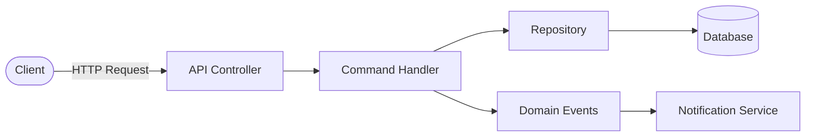
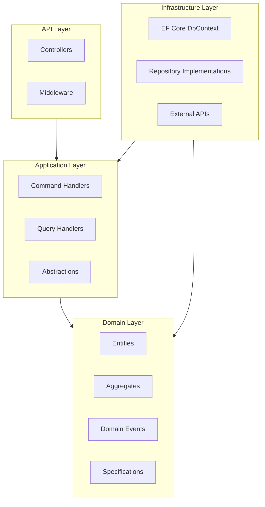
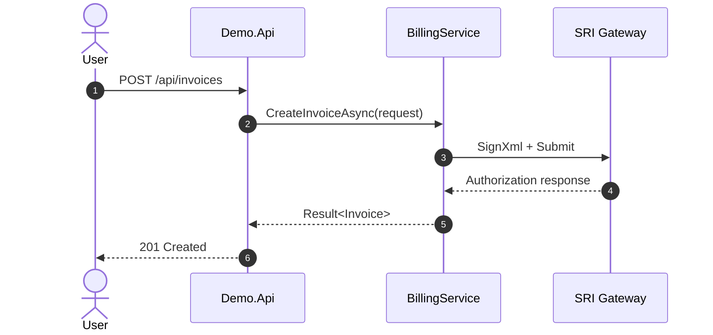

# Generate Architecture Diagram (Mermaid)

Produce a Mermaid architecture diagram that is fully compatible with GitHub Wikis and GitHub Markdown rendering.

## Required Information

Ask the user for the following before generating the diagram:

1. **Subject** — which library, feature, or flow to diagram (e.g. `Acontplus.Notifications`, publishing pipeline, DDD layer relationships)
2. **Diagram type** — see options below; default: `flowchart TD`
3. **Level of detail** — high-level (packages only), mid-level (packages + key classes), or detailed (classes + methods)
4. **Output location** — inline in a README, a new wiki page (`docs/wiki/<Name>.md`), or a standalone `.md` file

---

## GitHub Wiki Compatibility Rules

> These rules ensure the diagram renders correctly in GitHub Wiki pages and GitHub-flavored Markdown.

1. **Fenced code block**: always wrap with ` ```mermaid ` (three backticks + `mermaid`)
2. **No HTML inside node labels** — avoid `<br>`, `<b>`, etc. Use `\n` for line breaks in multi-line labels with quotes: `["Line1\nLine2"]`
3. **Quote node labels that contain spaces, parentheses, or special characters**: `A["My Label (v2)"]`
4. **Keep node IDs short and alphanumeric** — no spaces or hyphens in IDs (use underscores: `acontplus_core`)
5. **Avoid `graph` keyword** — use `flowchart` instead: `flowchart TD`
6. **Subgraph titles must be plain text** — no quotes: `subgraph src[Source Libraries]`
7. **Link labels** — use `-->|label|` syntax, keep labels short
8. **Maximum ~50 nodes** per diagram for readability; split into multiple diagrams if needed
9. **classDef** for color-coding: define styles at the bottom, apply with `:::className`
10. **No `end` missing** — every `subgraph` must have a closing `end`

---

## Diagram Type Reference

### Package Dependency Map (`flowchart TD`)

Use to show how `Acontplus.*` packages depend on each other.

```mermaid
flowchart TD
  subgraph infra[Infrastructure Layer]
    persistence_sql[Acontplus.Persistence.SqlServer]
    persistence_pg[Acontplus.Persistence.PostgreSQL]
    persistence_common[Acontplus.Persistence.Common]
    infrastructure[Acontplus.Infrastructure]
  end

  subgraph app[Application Layer]
    notifications[Acontplus.Notifications]
    billing[Acontplus.Billing]
    reports[Acontplus.Reports]
    services[Acontplus.Services]
    analytics[Acontplus.Analytics]
    s3[Acontplus.S3Application]
    barcode[Acontplus.Barcode]
    logging[Acontplus.Logging]
    api_docs[Acontplus.ApiDocumentation]
  end

  subgraph foundation[Foundation]
    core[Acontplus.Core]
    utilities[Acontplus.Utilities]
  end

  persistence_sql --> persistence_common
  persistence_pg --> persistence_common
  persistence_common --> core
  infrastructure --> core
  notifications --> core
  billing --> core
  reports --> core
  services --> core
  services --> utilities
  analytics --> core
  s3 --> core
  barcode --> utilities

  classDef foundation fill:#1f4e79,color:#fff,stroke:#1f4e79
  classDef app fill:#2e7d32,color:#fff,stroke:#2e7d32
  classDef infra fill:#4a148c,color:#fff,stroke:#4a148c

  class core,utilities foundation
  class notifications,billing,reports,services,analytics,s3,barcode,logging,api_docs app
  class persistence_sql,persistence_pg,persistence_common,infrastructure infra
```

> **Before drawing**: scan all `src/Acontplus.*/Acontplus.*.csproj` files and collect every `<ProjectReference>` (for intra-repo deps) and `<PackageReference Include="Acontplus.*">` (for NuGet deps). Build the graph from actual data — do not guess.



### Request / Data Flow (`flowchart LR`)

Use to show how a request flows through layers at runtime.



### DDD Layer Diagram (`flowchart TD` with subgraphs)

Use to show Clean Architecture / DDD ring structure.



### Sequence Diagram

Use for time-ordered interactions (e.g. SRI billing flow, webhook handling).



---

## Output Instructions

1. Generate the diagram inside a fenced ` ```mermaid ` block
2. Add a short prose paragraph above explaining what the diagram shows
3. If the output is for a **Wiki page**, use this file structure:

````markdown
# <Title>

<One paragraph describing what this diagram illustrates.>

## Diagram

```mermaid
<diagram here>
```
````

## Notes

- Note 1
- Note 2

```

4. If the output is **inline in a README**, place it after the "Features" section and before "API Reference"
5. Suggest logical split points if the diagram exceeds ~40 nodes

---

## Quality Checklist

- [ ] Diagram renders locally (no syntax errors in Mermaid)
- [ ] All node labels quoted if they contain spaces/special chars
- [ ] Node IDs use only `[a-zA-Z0-9_]`
- [ ] Every `subgraph` has a matching `end`
- [ ] `classDef` color palette uses readable contrast (dark bg + white text OR light bg + dark text)
- [ ] No HTML tags inside node labels
- [ ] Diagram fits within ~50 nodes; split if larger
- [ ] File saved to the correct location as agreed with the user
```
