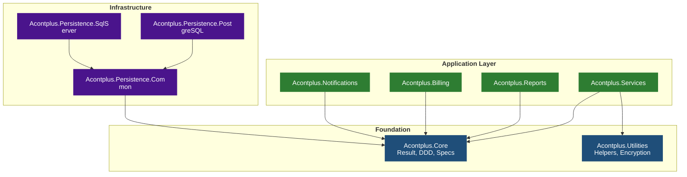
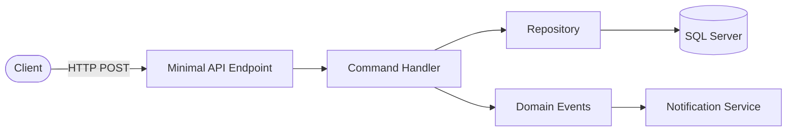

## Mermaid Version

Use **Mermaid v11+** syntax throughout. Key v11+ features used in this skill:

- Markdown string labels with backtick syntax: ``"`text`"`` — supports real newlines, bold, italics
- New shape syntax: `A@{ shape: rect, label: "text" }`
- `<br>` is supported in HTML-mode labels but markdown strings are preferred (cleaner, no HTML needed)

---

## Process

### Step 1 — Clarify (if not provided)

1. **Subject** — e.g. full monorepo deps, `Acontplus.Notifications` internals, SRI billing flow
2. **Diagram type** — package map / request flow / DDD layers / sequence (default: `flowchart TD`)
3. **Level of detail** — high-level / mid-level / detailed
4. **Output** — inline in README / wiki page `docs/wiki/<Name>.md` / standalone `.md`

---

### Step 2 — Gather Real Data First

**Before drawing anything**, read actual source files:

- Dependency maps: scan all `src/Acontplus.*/Acontplus.*.csproj`, extract every `<ProjectReference>` and `<PackageReference Include="Acontplus.*">` — never guess
- Flow diagrams: read the relevant service/handler code
- DDD layers: read the solution structure

---

### Step 3 — Mermaid v11 Syntax Rules

**Multi-line labels** — use markdown strings (v11+), preferred over `<br>`:

```
flowchart TD
  A["`Acontplus.Core
  Foundation Layer`"]
```

**When `<br>` is needed** (HTML labels, non-markdown mode):

```
flowchart TD
  A["Line 1<br/>Line 2"]
```

**Node ID rules**: `[a-zA-Z0-9_]` only — no hyphens or spaces.

**Always use `flowchart`**, not `graph`.

**Subgraph syntax**:

```
subgraph layerId[Layer Display Name]
  node1[Label]
end
```

**`classDef`** at the bottom, apply with `:::className` or `class nodeId className`:

```
classDef foundation fill:#1f4e79,color:#fff,stroke:#1f4e79
class core,utilities foundation
```

**Max ~50 nodes** per diagram — split if larger.

**Every `subgraph` needs a closing `end`**.

---

### Step 4 — Diagram Templates

#### Package Dependency Map



#### Request / Data Flow



#### Sequence Diagram

```mermaid
sequenceDiagram
  autonumber
  actor User
  participant API as Demo.Api
  participant Svc as BillingService
  participant SRI as SRI Gateway

  User->>API: POST /api/invoices
  API->>Svc: CreateInvoiceAsync(request)
  Svc->>SRI: SignXml + Submit
  SRI-->>Svc: Authorization response
  Svc-->>API: Result&#60;Invoice&#62;
  API-->>User: 201 Created
```



---

### Step 5 — Output Format

For wiki pages (`docs/wiki/<Name>.md`):

````markdown
# <Title>

<One paragraph describing what the diagram shows.>

## Diagram

```mermaid
<diagram here>
```
````

## Notes

- Note 1

```

For README: place after Features section, before API Reference.

---

### Step 6 — Quality Checklist

- [ ] Diagram built from actual `.csproj` data — not guessed
- [ ] Node IDs alphanumeric + underscores only
- [ ] Multi-line labels use markdown strings (backtick syntax) or `<br/>` for HTML mode
- [ ] Every `subgraph` has `end`
- [ ] ≤ ~50 nodes (split if larger)
- [ ] `classDef` contrast is readable (dark bg + white text)
- [ ] `flowchart` used, not `graph`
- [ ] Saved to the agreed location
```
