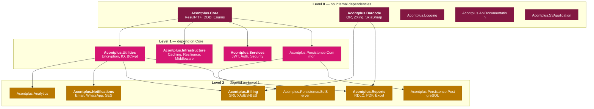

## Mermaid Version

Use **Mermaid v11+** syntax throughout:

- Markdown string labels: ``"`text`"`` with `config: htmlLabels: false` — real newlines, bold, italics
- No `\n` in labels — renders as literal text, not a newline
- `<br/>` only when HTML labels mode is explicitly required

---

## WHERE Diagrams Go — Decision Table

Before generating, decide the output location:

| Diagram type                        | Output location                  | Reason                                      |
| ----------------------------------- | -------------------------------- | ------------------------------------------- |
| Full monorepo dependency map        | `docs/wiki/Architecture.md`      | Already exists — update it, don't duplicate |
| DDD layers (cross-cutting)          | `docs/wiki/Architecture.md`      | Cross-cutting, belongs in wiki              |
| SRI billing flow                    | `docs/wiki/Architecture.md`      | Already exists                              |
| Infrastructure subsystem map        | `docs/wiki/Architecture.md`      | Already exists                              |
| Persistence dual-access pattern     | `docs/wiki/Architecture.md`      | Already exists                              |
| Package-specific internal structure | `src/Acontplus.<Name>/README.md` | Only for complex packages (see below)       |
| New wiki guide                      | `docs/wiki/<Name>.md`            | Add link to `docs/wiki/Home.md` after       |

**Packages where a README diagram adds real value** (non-obvious internal structure):

- `Core` — Domain/, DTOs/, Abstractions/, Validation/ layers
- `Billing` — SRI async authorization flow (sequence diagram)
- `Infrastructure` — 5 subsystems in one package
- `Persistence.SqlServer` / `Persistence.PostgreSQL` — EF Core + ADO.NET dual pattern
- `Notifications` — multi-channel (Email/WhatsApp/SES/templates)

**Packages where a README diagram is noise** (simple, obvious):

- `Reports`, `Services`, `Utilities`, `Analytics`, `Barcode`, `Logging`, `S3Application`, `ApiDocumentation`, `Persistence.Common`

---

## Process

### Step 1 — Clarify

1. **Subject** — which library, feature, or flow
2. **Diagram type** — package map / request flow / DDD layers / sequence / subsystem map
3. **Level of detail** — high-level / mid-level / detailed
4. **Output location** — use the decision table above; confirm before generating

---

### Step 2 — Gather Real Data First

**Never guess dependencies.** Before drawing any package dependency diagram:

- Read every `src/Acontplus.*/Acontplus.*.csproj`
- Extract `<PackageReference Include="Acontplus.*">` entries
- Build the graph from those — the real dependency levels are:

```
Level 0 (no internal deps): Core, Barcode, Logging, ApiDocumentation, S3Application
Level 1 (depend on Core):   Utilities, Infrastructure, Services, Persistence.Common
Level 2 (depend on L1):     Analytics, Notifications, Billing, Reports,
                             Persistence.SqlServer, Persistence.PostgreSQL
```

Key facts to never get wrong:

- `Billing` depends on **Utilities + Barcode** (not Core directly)
- `Reports` depends on **Utilities + Barcode** (same level as Billing — NOT level 4)
- `Barcode` has **zero internal deps** — it is Level 0
- `Analytics` depends only on **Utilities**
- `Notifications` depends only on **Utilities**
- `Services` depends only on **Core** (no Utilities)

---

### Step 3 — Mermaid v11 Syntax Rules

```yaml
# Always add this config block for markdown strings:
---
config:
  htmlLabels: false
---
```

Multi-line node labels:

```
node["`First line
Second line`"]
```

Node IDs: `[a-zA-Z0-9_]` only — no hyphens, no spaces.

Use `flowchart`, not `graph`. Every `subgraph` needs `end`. `classDef` at the bottom.

Color palette — **Acontplus brand colors** (use consistently across all diagrams):

```
Level 0 / Foundation: fill:#831742,color:#fff,stroke:#6a1235  (brand maroon)
Level 1:              fill:#d61572,color:#fff,stroke:#b01260  (brand primary magenta)
Level 2:              fill:#b97800,color:#fff,stroke:#9a6400  (brand accent amber, darkened)
API/Host layer:       fill:#0a7db5,color:#fff,stroke:#085e8a  (brand secondary blue, darkened)
Success/positive:     fill:#0a8f64,color:#fff,stroke:#097352  (brand green, darkened)
```

---

### Step 4 — Canonical Package Dependency Template

Use this as the starting point for any full monorepo dep diagram — update with current `.csproj` data:



### Step 5 — Sequence Diagram Template (for SRI / async flows)

```mermaid
sequenceDiagram
  autonumber
  actor User
  participant API as Demo.Api
  participant Svc as BillingService
  participant SRI as SRI Gateway

  User->>API: POST /api/invoices
  API->>Svc: CreateInvoiceAsync(request)
  Svc->>SRI: SignXml + Submit
  SRI-->>Svc: Authorization response
  Svc-->>API: Result&lt;Invoice&gt;
  API-->>User: 201 Created
```

---

### Step 6 — Output Format

For `docs/wiki/Architecture.md` (update existing page, don't create new one unless it's a genuinely new topic):

- Add diagram as a new `## Section` in the existing file
- Keep all diagrams in one Architecture.md page

For `src/Acontplus.<Name>/README.md`:

- Place after `## Features`, before `## Usage Examples`
- Keep it high-level — no more than ~20 nodes
- Caption with one sentence above the diagram block

For a new wiki page (`docs/wiki/<NewTopic>.md`):

- Add `[[<NewTopic>]] — description` to the Guides section in `docs/wiki/Home.md`

---

### Step 7 — Quality Checklist

- [ ] Dependencies verified from actual `.csproj` files — not assumed
- [ ] `Billing` shows deps on Utilities + Barcode, not Core
- [ ] `Reports` shows deps on Utilities + Barcode (Level 2, not Level 4)
- [ ] Config block `htmlLabels: false` present when using markdown strings
- [ ] Node IDs alphanumeric + underscores only
- [ ] Every `subgraph` has `end`
- [ ] ≤ ~50 nodes (split if larger)
- [ ] Color palette consistent (blue/green/purple/orange)
- [ ] Output location matches the decision table
- [ ] If wiki: `docs/wiki/Home.md` Guides list updated if new page added
