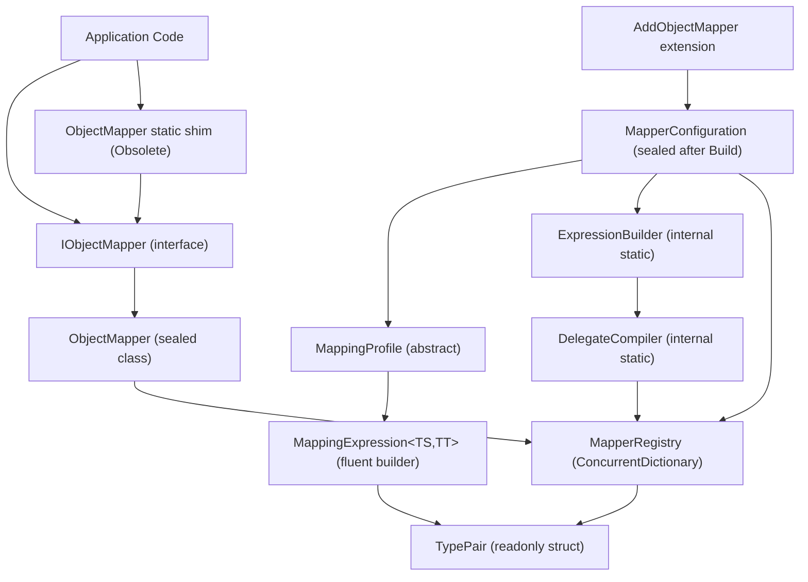

# Design Document — ObjectMapper Redesign

## Overview

The current `ObjectMapper` in `Acontplus.Utilities` executes full reflection on every call —
`GetProperties()`, `MethodInfo.Invoke()`, `MakeGenericMethod()`, and `Activator.CreateInstance()`
all run at mapping time with zero caching. The backing dictionary is not thread-safe, making
concurrent singleton use unsafe.

This redesign replaces that implementation with a compiled-delegate mapper. For every
`(TSource, TTarget)` type pair, an `Expression` tree is built once and compiled to a
`Func<TSource, TTarget>` delegate at startup. All subsequent calls execute the pre-compiled
delegate directly — zero reflection, zero allocations beyond the output object.

The new design lives entirely inside `Acontplus.Utilities` (no new NuGet dependencies beyond
what is already present) and introduces eight new source files under
`src/Acontplus.Utilities/Mapping/`, plus an update to the existing
`src/Acontplus.Utilities/Extensions/` folder.

---

## Architecture

### High-Level Component Diagram



### Startup vs Hot-Path Separation

The design has a clear two-phase lifecycle:

**Startup phase** (`AddObjectMapper` → `MapperConfiguration.Build()`):

- Profiles are collected.
- `ExpressionBuilder` traverses each registered `TypePair` and builds an `Expression` tree.
- `DelegateCompiler` calls `Expression.Lambda(...).Compile()` once per `TypePair`.
- Compiled delegates are stored in `MapperRegistry` under their `TypePair` key.
- Configuration is sealed — no further profiles can be added.

**Hot-path phase** (every `Map` call at request time):

- `ObjectMapper.Map<TSource,TTarget>(source)` looks up `TypePair` in `MapperRegistry`.
- If found, invokes the cached `Func<TSource,TTarget>` directly.
- If not found (convention-only, unregistered pair), builds and caches on first use via
  `ConcurrentDictionary.GetOrAdd` with a `Lazy<Func<,>>` factory.
- No `GetProperties()`, `MethodInfo.Invoke()`, or `Activator.CreateInstance()` at call time.

---

## Components and Interfaces

### File Layout

```
src/Acontplus.Utilities/Mapping/
├── ObjectMapper.cs              ← Replaced: backward-compat static shim (Obsolete)
├── IObjectMapper.cs             ← NEW: public interface
├── TypePair.cs                  ← NEW: readonly struct key
├── MappingProfile.cs            ← NEW: abstract base profile
├── MappingExpression.cs         ← NEW: fluent builder
├── MapperConfiguration.cs       ← NEW: sealed configuration / Build()
├── MapperRegistry.cs            ← NEW: ConcurrentDictionary delegate store
└── Internal/
    ├── ExpressionBuilder.cs     ← NEW: builds Expression trees
    └── DelegateCompiler.cs      ← NEW: compiles trees to Func delegates

src/Acontplus.Utilities/Extensions/
└── UtilitiesServiceExtensions.cs  ← UPDATED: adds AddObjectMapper overload
```

### `IObjectMapper` Interface

```csharp
namespace Acontplus.Utilities.Mapping;

/// <summary>
/// Abstraction for compiled-delegate object mapping.
/// Register via <c>services.AddObjectMapper(...)</c> and inject as a singleton.
/// </summary>
public interface IObjectMapper
{
    /// <summary>Maps <paramref name="source"/> to a new <typeparamref name="TTarget"/> instance.</summary>
    TTarget Map<TSource, TTarget>(TSource source);

    /// <summary>Maps <paramref name="source"/> onto an existing <paramref name="destination"/>.</summary>
    TTarget Map<TSource, TTarget>(TSource source, TTarget destination);

    /// <summary>Maps each element of <paramref name="source"/> to <typeparamref name="TTarget"/>.</summary>
    IEnumerable<TTarget> Map<TSource, TTarget>(IEnumerable<TSource> source);

    /// <summary>
    /// Projects a queryable source sequence to <typeparamref name="TTarget"/> using a pure
    /// <see cref="Expression"/> tree so that LINQ query providers (e.g., EF Core) can translate
    /// the projection to SQL without materialising source objects.
    /// </summary>
    IQueryable<TTarget> ProjectTo<TSource, TTarget>(IQueryable<TSource> source);
}
```

### `TypePair` Value Type

```csharp
namespace Acontplus.Utilities.Mapping;

/// <summary>
/// Identifies a unique mapping route from <see cref="SourceType"/> to <see cref="TargetType"/>.
/// Implemented as a value type to allow efficient use as a dictionary key.
/// </summary>
public readonly struct TypePair : IEquatable<TypePair>
{
    /// <summary>The source CLR type.</summary>
    public Type SourceType { get; }

    /// <summary>The target CLR type.</summary>
    public Type TargetType { get; }

    /// <summary>Initialises a new <see cref="TypePair"/>.</summary>
    public TypePair(Type sourceType, Type targetType);

    /// <inheritdoc />
    public bool Equals(TypePair other);

    /// <inheritdoc />
    public override bool Equals(object? obj);

    /// <inheritdoc />
    public override int GetHashCode();

    /// <inheritdoc />
    public override string ToString(); // "SourceType => TargetType"
}
```

### `MappingProfile` Abstract Base

```csharp
namespace Acontplus.Utilities.Mapping;

/// <summary>
/// Base class for grouping a set of <c>CreateMap</c> registrations.
/// Derive from this class and register instances via <c>AddObjectMapper(profile)</c>.
/// </summary>
public abstract class MappingProfile
{
    internal Dictionary<TypePair, MappingExpressionBase> Registrations { get; }

    /// <summary>
    /// Registers a mapping from <typeparamref name="TSource"/> to <typeparamref name="TTarget"/>
    /// and returns a fluent builder for further configuration.
    /// Calling this method a second time for the same <see cref="TypePair"/> within the same
    /// profile overwrites the previous registration.
    /// </summary>
    protected MappingExpression<TSource, TTarget> CreateMap<TSource, TTarget>();
}
```

### `MappingExpression<TSource, TTarget>` Fluent Builder

```csharp
namespace Acontplus.Utilities.Mapping;

/// <summary>
/// Fluent builder for configuring the mapping from
/// <typeparamref name="TSource"/> to <typeparamref name="TTarget"/>.
/// </summary>
public sealed class MappingExpression<TSource, TTarget> : MappingExpressionBase
{
    /// <summary>
    /// Maps a destination member via a source member expression.
    /// Throws <see cref="InvalidOperationException"/> at configuration time if the
    /// destination expression does not resolve to a writable property of
    /// <typeparamref name="TTarget"/>.
    /// </summary>
    public MappingExpression<TSource, TTarget> ForMember<TProperty>(
        Expression<Func<TTarget, TProperty>> destination,
        Expression<Func<TSource, TProperty>> source);

    /// <summary>
    /// Maps a destination member via an arbitrary delegate resolver.
    /// Note: this overload is incompatible with <c>ProjectTo</c>.
    /// </summary>
    public MappingExpression<TSource, TTarget> ForMember<TProperty>(
        Expression<Func<TTarget, TProperty>> destination,
        Func<TSource, TProperty> resolver);

    /// <summary>
    /// Excludes a destination member from forward-direction mapping.
    /// The exclusion does not propagate to any reverse mapping.
    /// </summary>
    public MappingExpression<TSource, TTarget> Ignore<TProperty>(
        Expression<Func<TTarget, TProperty>> destination);

    /// <summary>
    /// Binds a source member expression to a named constructor parameter on
    /// <typeparamref name="TTarget"/>.
    /// Throws <see cref="InvalidOperationException"/> at delegate-compilation time if
    /// <paramref name="paramName"/> does not match any parameter on the selected constructor.
    /// </summary>
    public MappingExpression<TSource, TTarget> ForCtorParam<TProperty>(
        string paramName,
        Expression<Func<TSource, TProperty>> source);

    /// <summary>
    /// Registers the inverse <see cref="TypePair"/> using name-based convention matching only.
    /// Forward <c>ForMember</c>, <c>ForCtorParam</c>, and <c>Ignore</c> rules are NOT carried over.
    /// </summary>
    public MappingExpression<TSource, TTarget> ReverseMap();
}
```

### `MapperConfiguration` (sealed after Build)

```csharp
namespace Acontplus.Utilities.Mapping;

/// <summary>
/// Immutable snapshot of all registered mapping profiles.
/// Call <see cref="Build"/> to compile delegates and produce a <see cref="MapperRegistry"/>.
/// After <see cref="Build"/> returns, no further profiles may be added.
/// </summary>
public sealed class MapperConfiguration
{
    /// <summary>
    /// Adds a <see cref="MappingProfile"/> to the configuration.
    /// Throws <see cref="InvalidOperationException"/> if called after <see cref="Build"/>.
    /// </summary>
    public MapperConfiguration AddProfile(MappingProfile profile);

    /// <summary>
    /// Validates all registered <see cref="TypePair"/>s, compiles delegates for each one,
    /// and returns a fully initialised <see cref="MapperRegistry"/>.
    /// Throws a single <see cref="InvalidOperationException"/> listing every violation if
    /// any <c>ForMember</c> target does not exist or has an incompatible resolved type.
    /// Seals this configuration — further calls to <see cref="AddProfile"/> will throw.
    /// </summary>
    public MapperRegistry Build();
}
```

### `MapperRegistry` (thread-safe delegate store)

```csharp
namespace Acontplus.Utilities.Mapping;

/// <summary>
/// Thread-safe store for compiled <c>Func&lt;TSource, TTarget&gt;</c> delegates, keyed by
/// <see cref="TypePair"/>. After startup, all operations are lock-free concurrent reads
/// (or wait-free <c>GetOrAdd</c> with <c>Lazy&lt;T&gt;</c> for on-demand convention pairs).
/// </summary>
internal sealed class MapperRegistry
{
    private readonly ConcurrentDictionary<TypePair, Lazy<Delegate>> _delegates;

    /// <summary>Stores a pre-compiled delegate for the given <see cref="TypePair"/>.</summary>
    internal void Register(TypePair pair, Delegate compiledDelegate);

    /// <summary>
    /// Returns the compiled delegate for the given <see cref="TypePair"/>.
    /// If the pair is not explicitly registered, applies convention mapping, compiles,
    /// caches, and returns the delegate. Thread-safe under concurrent first-use.
    /// Throws <see cref="InvalidOperationException"/> if convention mapping cannot produce
    /// a valid delegate.
    /// </summary>
    internal Delegate GetOrAdd(TypePair pair);

    /// <summary>Returns <c>true</c> if a compiled delegate exists for <paramref name="pair"/>.</summary>
    internal bool TryGet(TypePair pair, out Delegate? compiledDelegate);
}
```

### `ObjectMapper` Concrete Implementation

```csharp
namespace Acontplus.Utilities.Mapping;

/// <summary>
/// Default implementation of <see cref="IObjectMapper"/> backed by pre-compiled
/// <c>Expression</c>-tree delegates. Register as a singleton via
/// <c>services.AddObjectMapper(...)</c>.
/// </summary>
public sealed class ObjectMapper : IObjectMapper
{
    /// <summary>Initialises the mapper with a fully built <see cref="MapperRegistry"/>.</summary>
    public ObjectMapper(MapperRegistry registry);

    /// <inheritdoc />
    public TTarget Map<TSource, TTarget>(TSource source);

    /// <inheritdoc />
    public TTarget Map<TSource, TTarget>(TSource source, TTarget destination);

    /// <inheritdoc />
    public IEnumerable<TTarget> Map<TSource, TTarget>(IEnumerable<TSource> source);

    /// <inheritdoc />
    public IQueryable<TTarget> ProjectTo<TSource, TTarget>(IQueryable<TSource> source);
}
```

### `DelegateCompiler` Internal Helper

```csharp
namespace Acontplus.Utilities.Mapping.Internal;

/// <summary>
/// Compiles <see cref="Expression"/> trees into <c>Func&lt;TSource, TTarget&gt;</c> delegates.
/// Handles flat, nested, collection, and constructor-based mappings.
/// </summary>
internal static class DelegateCompiler
{
    /// <summary>
    /// Compiles the provided expression tree into a typed delegate and returns it
    /// wrapped as a <see cref="Delegate"/>.
    /// </summary>
    internal static Delegate Compile(LambdaExpression expression);

    /// <summary>
    /// Builds and compiles a delegate for a convention-based <see cref="TypePair"/>
    /// with no explicit <see cref="MappingExpressionBase"/> configuration.
    /// </summary>
    internal static Delegate CompileConvention(TypePair pair, MapperRegistry registry);
}
```

### `ExpressionBuilder` Internal Helper

```csharp
namespace Acontplus.Utilities.Mapping.Internal;

/// <summary>
/// Builds <see cref="Expression"/> trees for mapping and projection operations.
/// Does not perform compilation — returns <see cref="LambdaExpression"/> instances only.
/// </summary>
internal static class ExpressionBuilder
{
    /// <summary>
    /// Builds a <c>LambdaExpression</c> for the given <see cref="TypePair"/> and optional
    /// <see cref="MappingExpressionBase"/> configuration. Handles flat, nested, collection,
    /// and constructor-parameter mappings. Uses <paramref name="registry"/> to resolve
    /// nested pair delegates (embedding them inline rather than calling back into the registry
    /// at runtime). Detects cycles via an in-progress <see cref="HashSet{TypePair}"/> and
    /// breaks them with a deferred <c>Func&lt;&gt;</c> closure.
    /// </summary>
    internal static LambdaExpression BuildMappingExpression(
        TypePair pair,
        MappingExpressionBase? config,
        MapperRegistry registry,
        HashSet<TypePair> inProgress);

    /// <summary>
    /// Builds a pure <c>Expression&lt;Func&lt;TSource, TTarget&gt;&gt;</c> suitable for
    /// passing to <c>IQueryable.Select</c>. Throws <see cref="NotSupportedException"/> for
    /// any member that requires a compiled delegate resolver or <c>Convert.ChangeType</c>.
    /// </summary>
    internal static LambdaExpression BuildProjectionExpression(
        TypePair pair,
        MappingExpressionBase? config);
}
```

### Static Backward-Compatibility Shim

```csharp
namespace Acontplus.Utilities.Mapping;

/// <summary>
/// Static backward-compatibility surface for existing call sites.
/// All methods forward to the <see cref="IObjectMapper"/> singleton registered via DI.
/// </summary>
/// <remarks>
/// The static initialiser does NOT throw — the singleton reference remains <c>null</c>
/// until <c>AddObjectMapper</c> is called. Static mapping methods throw
/// <see cref="InvalidOperationException"/> if invoked before DI initialisation.
/// </remarks>
[Obsolete("Use IObjectMapper via DI. The static API will be removed in v3.0.")]
public static class ObjectMapper  // replaces current ObjectMapper.cs
{
    /// <summary>Creates a mapping and returns the fluent builder (forwards to singleton).</summary>
    public static MappingExpression<TSource, TTarget> CreateMap<TSource, TTarget>();

    /// <summary>Maps source to a new target instance (forwards to singleton).</summary>
    public static TTarget? Map<TSource, TTarget>(TSource source);

    /// <summary>Maps source onto an existing destination (forwards to singleton).</summary>
    public static TTarget Map<TSource, TTarget>(TSource source, TTarget destination);

    /// <summary>Called by <c>AddObjectMapper</c> to wire up the singleton reference.</summary>
    internal static void SetSingleton(IObjectMapper mapper);
}
```

### DI Extension

```csharp
namespace Acontplus.Utilities.Extensions;

public static partial class UtilitiesServiceExtensions
{
    /// <summary>
    /// Registers <see cref="IObjectMapper"/> as a <see cref="ServiceLifetime.Singleton"/>,
    /// compiling delegates for all explicitly registered type pairs during
    /// <c>IServiceProvider</c> construction.
    /// </summary>
    /// <param name="services">The service collection.</param>
    /// <param name="profiles">Zero or more <see cref="MappingProfile"/> instances.</param>
    /// <returns>The same <see cref="IServiceCollection"/> for chaining.</returns>
    /// <exception cref="InvalidOperationException">
    /// Thrown if <see cref="IObjectMapper"/> is already registered, or if any profile
    /// contains misconfigured <c>ForMember</c> targets.
    /// </exception>
    public static IServiceCollection AddObjectMapper(
        this IServiceCollection services,
        params MappingProfile[] profiles);
}
```

---

## Data Models

### `MappingExpressionBase` (Internal Abstract)

Holds the raw rule data collected during profile configuration. `MappingExpression<TS,TT>`
inherits from it and populates these collections via the fluent API. `ExpressionBuilder` reads
from these collections during tree construction.

```
MappingExpressionBase
├── TypePair Pair
├── Dictionary<string, LambdaExpression?> MemberRules
│   │  key   = destination property name
│   │  value = source LambdaExpression (null = Ignore rule)
├── Dictionary<string, Func<object,object?>> DelegateResolvers
│   │  key   = destination property name
│   │  value = boxed Func resolver (incompatible with ProjectTo)
├── Dictionary<string, LambdaExpression> CtorParamRules
│   │  key   = constructor parameter name (case-insensitive)
│   │  value = source LambdaExpression
└── bool HasReverseMap
```

### Compiled Delegate Representation

At runtime the registry stores `Lazy<Delegate>` values. The underlying delegate is one of:

| Scenario                   | Actual type stored                       |
| -------------------------- | ---------------------------------------- |
| New-object mapping         | `Func<TSource, TTarget>`                 |
| Populate-existing mapping  | `Action<TSource, TTarget>`               |
| Collection element mapping | `Func<TSource, TTarget>` (element-level) |

All are stored as `Delegate` and cast at the call site once the type parameters are known.

### `TypePair` Equality Contract

`TypePair` is a `readonly struct` with `IEquatable<TypePair>` implemented using
`(SourceType, TargetType)` as the composite key. `GetHashCode` uses
`HashCode.Combine(SourceType, TargetType)`. This allows it to serve as a dictionary key in
`ConcurrentDictionary<TypePair, Lazy<Delegate>>` with O(1) lookup.

---

## Expression-Tree Delegate Compilation Strategy

This section describes how `ExpressionBuilder` builds the `LambdaExpression` for each mapping
scenario. All trees have the same root shape:

```csharp
// source parameter: ParameterExpression for TSource
// body: MemberInitExpression (or NewExpression for records with all-init props)
(TSource source) => new TTarget
{
    Prop1 = <expr1>,
    Prop2 = <expr2>,
    ...
}
```

### Flat / Simple-Type Members

For each destination property `P` of a simple type where a matching source property `Q` exists
by name (case-insensitive):

- **Same type or assignable**: `MemberExpression` — `source.Q`.
- **Convertible simple type** (e.g., `int` → `long`): `Convert(source.Q, typeof(long))` expression.
- **Convert.ChangeType at runtime** (non-directly-assignable simples):
  wraps in `Expression.Call(typeof(Convert), nameof(Convert.ChangeType), ...)` with a
  `try/catch` expression returning `default` on failure.
  Note: this pattern is **not** used in `ProjectTo` expressions.

### Nested Complex-Type Members

For a destination property `P` of complex type `TNestedTarget` where the source has a property
`Q` of complex type `TNestedSource`:

1. Check if `(TNestedSource, TNestedTarget)` is already in `inProgress` (cycle detection).
   - If **not in progress**: recurse into `BuildMappingExpression` for the nested pair,
     adding the pair to `inProgress` first, removing on return.
   - If **in progress** (cycle detected): create a deferred `Func<TNestedSource, TNestedTarget>`
     captured as a `ConstantExpression` holding a `Lazy<Func<>>` that will be resolved from
     the registry after all delegates are compiled. At call time this becomes:
     `Expression.Invoke(lazyGetterExpr, source.Q)`.
2. The resulting nested `LambdaExpression` body is inlined into the parent `MemberBinding`.

```
// Inlined nested mapping (no cycle)
Dest.Address = new Address { Street = source.Address.Street, City = source.Address.City }

// Deferred via closure (cycle: Person.Spouse → Person)
Dest.Spouse = _spouseMapper.Value(source.Spouse)  // _spouseMapper is a Lazy<Func<Person,Person>>
```

### Collection Members

For a destination property `P` of collection type `IEnumerable<TElement>` (or any supported
variant) where the source has a collection property `Q`:

1. Resolve the element `TypePair` `(TSourceElement, TTargetElement)`.
2. Obtain or compile the element `Func<TSourceElement, TTargetElement>` delegate from the registry.
3. Build a `Select` expression (calling `Enumerable.Select`) followed by a materialisation
   expression matching the destination collection type:
   - `T[]` → `.ToArray()`
   - `List<T>` / `IList<T>` / `ICollection<T>` / `IEnumerable<T>` / `IReadOnlyList<T>` /
     `IReadOnlyCollection<T>` → `.ToList()`
4. Wrap in a null-guard: if source collection is null, produce `null` or `new List<T>()`
   depending on destination nullability.

### Constructor-Parameter Mapping

When the target type has no parameterless constructor:

1. Select the public constructor with the most satisfiable parameters.
2. For each parameter, resolve the argument expression in priority order:
   a. Explicit `ForCtorParam` rule → use the rule's `LambdaExpression`.
   b. Convention name match on source → `MemberExpression` for the matching source property.
   c. Declared default value → `ConstantExpression` of the default.
   d. None of the above → throw `InvalidOperationException` at compilation time.
3. Build `Expression.New(constructor, argExpressions)`.
4. For any **settable properties** not covered by constructor parameters (non-record types),
   attach them as `MemberBinding`s in a `MemberInitExpression` wrapping the `NewExpression`.

For `record` and `record struct` types with `init`-only properties, all properties are supplied
as constructor arguments in the `NewExpression` (step 3); no `MemberInitExpression` is needed.

### `ProjectTo<TTarget>` Expression Building

`ExpressionBuilder.BuildProjectionExpression` follows the same member-resolution rules but with
these constraints:

- **No `Convert.ChangeType`** → if a simple-type conversion requires it, throw
  `NotSupportedException` for that member.
- **No `Func<TSource,TProperty>` delegate resolvers** → throw `NotSupportedException` naming
  the member.
- **No nested compiled delegates** → nested complex-type pairs must also produce pure
  `MemberExpression` trees (recursively).
- Returns a `LambdaExpression` that is cast to `Expression<Func<TSource,TTarget>>` and passed
  directly to `IQueryable<TSource>.Select(...)`.

---

## Cycle Detection

Mapping cycles occur when type `A` has a property of type `B` and type `B` has a property of
type `A`. Without special handling, `ExpressionBuilder` would recurse infinitely.

### Detection Mechanism

`BuildMappingExpression` receives a `HashSet<TypePair> inProgress` parameter that tracks which
`TypePair`s are currently being compiled on the current call stack.

```
BuildMappingExpression(A→B, inProgress={})
  inProgress.Add(A→B)
  // encounters property B.Sponsor of type A
  BuildMappingExpression(B→A, inProgress={A→B})
    inProgress.Add(B→A)
    // encounters property A.Items of type B
    BuildMappingExpression(A→B, inProgress={A→B, B→A})
      TypePair already in inProgress → CYCLE DETECTED
```

### Resolution via Deferred `Lazy<Func<>>` Closure

When a cycle is detected for `TypePair (C, D)`:

1. A `Lazy<Func<C, D>>` is created with a factory that reads the delegate from the registry
   after all compilation completes.
2. A `ConstantExpression` holding a reference to the `Lazy<Func<C,D>>` is captured in the
   parent expression tree.
3. The invocation is: `Expression.Invoke(Expression.Property(lazyConst, "Value"), sourceExpr)`.
4. Because the `Lazy<>` is not evaluated until the delegate is first invoked at runtime (after
   `Build()` returns), the circular reference is resolved correctly.

This approach guarantees:

- `MapperConfiguration.Build()` completes without throwing for cycles.
- Runtime mapping of cyclic graphs produces correct results.
- The `Lazy` factory overhead is incurred exactly once per cyclic pair.

---

## Correctness Properties

_A property is a characteristic or behavior that should hold true across all valid executions of a system — essentially, a formal statement about what the system should do. Properties serve as the bridge between human-readable specifications and machine-verifiable correctness guarantees._

**Property reflection summary:** After reviewing all testable criteria from the prework, several
groups were identified for consolidation:

- 1.1 and 1.3 (compile-once idempotence) → merged into Property 1.
- 4.1 and 7.2 (convention name matching — flat vs ctor) → both kept but scoped separately,
  as the mechanism differs (MemberBinding vs NewExpression argument).
- 4.2 and 4.4 (unmapped/non-settable members default) → merged into Property 4.
- 4.6 and 5.3/5.4 (null source at any depth) → merged into Property 5.
- 6.1 and 6.6 (collection element mapping + IEnumerable overload) → merged into Property 9.
- 2.1 and 2.2 (thread safety + single compilation under concurrency) → merged into Property 2.
- 10.1 and 10.2 (null-source and null-dest argument handling) → kept as Property 5 (null-source)
  and Property 13 (null-dest).

---

### Property 1: Delegate compilation is idempotent — compile once, cache forever

_For any_ `TypePair` (whether explicitly registered or convention-derived), after the first call
that causes the delegate to be compiled, the number of compilation events for that `TypePair`
SHALL equal exactly 1, regardless of how many subsequent `Map` calls are made for that pair.

**Validates: Requirements 1.1, 1.3, 1.4**

---

### Property 2: Thread-safe concurrent mapping produces consistent results

_For any_ registered `TypePair` and any number of concurrent threads calling `Map` simultaneously
(including first-use compilation of convention pairs), every thread SHALL receive a correctly
mapped result and no `InvalidOperationException` or data corruption SHALL occur.

**Validates: Requirements 2.1, 2.2, 2.3**

---

### Property 3: Sealed configuration rejects late registrations

_For any_ `MapperConfiguration` on which `Build()` has been called, any subsequent call to
`AddProfile` SHALL always throw `InvalidOperationException`, regardless of the profile passed.

**Validates: Requirement 2.4**

---

### Property 4: Unmapped and non-writable destination members retain CLR defaults

_For any_ source type `S` and destination type `T`, after mapping, every destination member
that has no matching source member by name (case-insensitive) AND has no `ForMember` rule SHALL
equal `default(TMember)`, and every destination member without a public setter and without an
`init` accessor SHALL also equal `default(TMember)` — in both cases without throwing an exception.

**Validates: Requirements 4.2, 4.4**

---

### Property 5: Null source values never throw — produce correct defaults

_For any_ registered `TypePair`, calling `Map<TSource, TTarget>(null)` SHALL return
`default(TTarget)`. _For any_ nested Complex-type or collection source member whose value is
`null`, the destination member SHALL receive `null` (if nullable reference type) or
`default(TMember)` (if non-nullable value type), without throwing `NullReferenceException` or
`InvalidCastException` at any nesting depth.

**Validates: Requirements 4.6, 5.3, 5.4, 10.1**

---

### Property 6: Convention flat mapping copies all name-matched members

_For any_ source object `s` of type `S` and a destination type `T` where no explicit
`ForMember` rules are registered, the result of `Map<S,T>(s)` SHALL have every destination
property whose name (case-insensitive) matches exactly one source property equal to the
source property's value (after any required compatible-type conversion).

**Validates: Requirements 4.1, 4.3**

---

### Property 7: Ignored members always equal CLR default in forward direction

_For any_ `TypePair (S, T)` where a destination member `P` has an `Ignore` rule configured,
the value of `P` on the mapped result SHALL always equal `default(TP)`, regardless of the
source object's value for any corresponding property. The reverse mapping (if registered) SHALL
NOT apply this ignore rule.

**Validates: Requirements 3.4, 8.3**

---

### Property 8: Constructor-mapped targets receive correct values from source

_For any_ target type `T` with no parameterless constructor and a source type `S` where all
required constructor parameters are satisfiable (via convention, `ForCtorParam`, or declared
defaults), the result of `Map<S,T>(s)` SHALL have all constructor-parameter-backed properties
equal to the expected values derived from `s`.

**Validates: Requirements 7.1, 7.2, 7.3, 7.5, 4.5**

---

### Property 9: Collection mapping preserves cardinality and correctly maps each element

_For any_ source object containing a collection property of type `IEnumerable<TSourceElement>`,
the mapped destination collection SHALL have the same element count as the source collection,
and each element at index `i` in the destination SHALL be the correctly mapped result of the
source element at index `i`. Null source collections produce `null` (nullable destination) or
an empty collection (non-nullable destination).

**Validates: Requirements 6.1, 6.3, 6.4, 6.5, 6.6**

---

### Property 10: ProjectTo produces a queryable whose results match in-memory mapping

_For any_ registered `TypePair (S, T)` that uses only directly-assignable members and pure
`Expression`-based `ForMember` rules, the sequence produced by `ProjectTo<S,T>(queryable)`
SHALL be element-wise equal to the sequence produced by
`queryable.AsEnumerable().Select(s => Map<S,T>(s))`.

**Validates: Requirements 8.1, 8.2, 8.5**

---

### Property 11: Last-registered CreateMap for a TypePair wins

_For any_ sequence of `CreateMap<S,T>()` calls within a single `MappingProfile`, only the
configuration from the final call for the same `TypePair` SHALL be active when `Build()` is
called; earlier registrations for the same pair SHALL have no observable effect on mapping output.

**Validates: Requirement 3.1**

---

### Property 12: Cyclic object graphs map correctly and Build() does not throw

_For any_ pair of types `A` and `B` where `A` has a property of type `B` and `B` has a property
of type `A` (or any analogous cycle of any length), `MapperConfiguration.Build()` SHALL complete
without throwing, and a call to `Map<A, B>` on a finite object graph SHALL produce a correctly
mapped result without `StackOverflowException`.

**Validates: Requirement 10.5**

---

### Property 13: Null destination argument always throws ArgumentNullException

_For any_ registered `TypePair` and any non-null source object `s`, calling
`Map<S,T>(s, null)` SHALL always throw `ArgumentNullException` with `ParamName == "destination"`.

**Validates: Requirement 10.2**

---

### Property 14: Static shim forwards to singleton — results are identical to DI-resolved mapper

_For any_ source object `s` and registered `TypePair (S, T)`, the result of the static
`ObjectMapper.Map<S,T>(s)` SHALL be value-equal to the result of calling `Map<S,T>(s)` on the
`IObjectMapper` singleton resolved from the DI container.

**Validates: Requirement 11.3**

---

## Error Handling

### Configuration-Time Errors (thrown during `Build()` or profile configuration)

| Scenario                                                         | Exception                   | Message format                                                                                                                |
| ---------------------------------------------------------------- | --------------------------- | ----------------------------------------------------------------------------------------------------------------------------- |
| `ForMember` dest expression resolves to non-existent property    | `InvalidOperationException` | `"member '{MemberName}' does not exist on {TargetType}"`                                                                      |
| `ForMember` resolver type not assignable to destination type     | `InvalidOperationException` | `"{TypePairDesc}: member '{MemberName}' — resolved type '{ResolvedType}' is not assignable to destination type '{DestType}'"` |
| `ForCtorParam` names a param not on selected constructor         | `InvalidOperationException` | `"{TypePairDesc}: constructor parameter '{ParamName}' not found on {TargetType}"`                                             |
| No satisfiable public constructor                                | `InvalidOperationException` | `"Cannot create {TargetType}: unsatisfied parameters: {param1}, {param2}"`                                                    |
| Convention mapping produces no valid delegate                    | `InvalidOperationException` | `"No mapping could be derived for {TypePairDesc}: no matched members and no satisfiable constructor"`                         |
| `AddProfile` called after `Build()`                              | `InvalidOperationException` | `"MapperConfiguration is sealed. Call AddProfile before Build()."`                                                            |
| `AddObjectMapper` called when `IObjectMapper` already registered | `InvalidOperationException` | `"IObjectMapper is already registered in the service collection."`                                                            |

Multiple violations from `Build()` are collected in a single pass and reported in one
`InvalidOperationException` whose `Message` concatenates all violation lines.

### Call-Time Errors

| Scenario                                     | Exception                              | Notes                                                                                          |
| -------------------------------------------- | -------------------------------------- | ---------------------------------------------------------------------------------------------- |
| `Map(null)`                                  | Returns `default(TTarget)`             | No exception thrown                                                                            |
| `Map(source, null destination)`              | `ArgumentNullException("destination")` | Always thrown                                                                                  |
| `ProjectTo(null source)`                     | `ArgumentNullException("source")`      | Always thrown                                                                                  |
| `ProjectTo` with `Func<>` resolver           | `NotSupportedException`                | Names the offending member                                                                     |
| `ProjectTo` with `Convert.ChangeType` member | `NotSupportedException`                | Names the offending member                                                                     |
| Static shim called before `AddObjectMapper`  | `InvalidOperationException`            | `"IObjectMapper has not been initialised. Call services.AddObjectMapper(...) during startup."` |
| Unregistered `TypePair`, convention fails    | `InvalidOperationException`            | Names the unresolvable pair                                                                    |

### No Silent Swallowing

The current implementation silently ignores `InvalidCastException` during type conversion. The
redesign preserves the "assign default on conversion failure" contract for mapped delegates
(Requirement 4.3), but all configuration-time errors are always surfaced — never swallowed.

---

## Testing Strategy

### Framework and Tooling

| Concern                 | Tool                                                  |
| ----------------------- | ----------------------------------------------------- |
| Unit and property tests | xUnit + FsCheck (property-based)                      |
| Assertion library       | FluentAssertions                                      |
| Mocking                 | NSubstitute                                           |
| Test project            | `tests/Acontplus.Utilities.Tests/` (existing project) |

FsCheck is the standard .NET property-based testing library. It integrates with xUnit via the
`FsCheck.Xunit` NuGet package. Each property test runs a minimum of **100 iterations** by
default; any property involving collection or graph depth scenarios is configured for at least
**200 iterations**.

### Property-Based Tests

Each correctness property from the Correctness Properties section is implemented as a single
FsCheck `Property` test tagged with:

```csharp
// Feature: object-mapper-redesign, Property N: <property text>
```

| Property                | Test method pattern                                    | Key generators                               |
| ----------------------- | ------------------------------------------------------ | -------------------------------------------- |
| P1 – Compile once       | `Map_ForAnyTypePair_CompilesDelegateExactlyOnce`       | Arbitrary flat POCO generator                |
| P2 – Thread safety      | `Map_ConcurrentCalls_NeverCorrupt`                     | `Gen.Constant`, `Task.WhenAll`               |
| P3 – Sealed config      | `AddProfile_AfterBuild_AlwaysThrows`                   | Arbitrary `MappingProfile` subclass          |
| P4 – Defaults preserved | `Map_UnmappedMembers_RetainDefaults`                   | Source/dest type pairs with mismatched props |
| P5 – Null safety        | `Map_NullSource_ReturnsDefault`                        | Arbitrary target types, null sources         |
| P6 – Convention flat    | `Map_ConventionFlat_CopiesAllMatchedMembers`           | Random flat DTO generators                   |
| P7 – Ignore             | `Map_WithIgnore_IgnoredMemberEqualsDefault`            | Any POCO pair with one ignored prop          |
| P8 – Ctor mapping       | `Map_ImmutableTarget_PopulatesCtorArgs`                | Records and ctor-only POCOs                  |
| P9 – Collection         | `Map_CollectionProperty_PreservesCardinalityAndValues` | Lists of arbitrary POCOs                     |
| P10 – ProjectTo         | `ProjectTo_MatchesInMemoryMapping`                     | In-memory `IQueryable` from lists            |
| P11 – Last-wins         | `CreateMap_CalledTwice_LastConfigurationWins`          | Two conflicting profiles                     |
| P12 – Cycles            | `Map_CyclicGraph_CompletesWithoutException`            | Mutually referencing type pairs              |
| P13 – Null dest         | `Map_NullDestination_ThrowsArgumentNullException`      | Any source with null dest                    |
| P14 – Static shim       | `StaticMap_EqualsInstanceMap_ForAnySource`             | Flat POCO sources                            |

### Unit Tests (Example-Based)

Unit tests cover concrete scenarios, error paths, and edge cases that property tests do not
reach efficiently:

- `MapperConfiguration_Build_ThrowsOnMisconfiguredForMember` — verifies aggregate error listing.
- `MapperConfiguration_Build_ThrowsOnUnsatisfiableConstructor` — verifies correct message.
- `ProjectTo_WithFuncResolver_ThrowsNotSupportedException`.
- `ProjectTo_WithConvertChangeTypeMember_ThrowsNotSupportedException`.
- `Map_TenLevelsDeepGraph_MapsCorrectly` — smoke test for deep nesting.
- `Map_CaseInsensitiveAmbiguity_SkipsMember` — verifies Requirement 4.7.
- `Map_RecordWithInitOnlyProperties_UsesNewExpression` — verifies Requirement 4.5.
- `ForCtorParam_NonexistentParam_ThrowsAtBuild` — Requirement 7.4.
- `ReverseMap_DoesNotCarryForwardRules` — Requirement 3.8.
- `StaticShim_BeforeAddObjectMapper_ThrowsInvalidOperationException` — Requirement 11.6.
- `AddObjectMapper_AlreadyRegistered_ThrowsInvalidOperationException` — Requirement 9.6.

### Integration Tests

- `AddObjectMapper_ZeroProfiles_ServesConventionMappingOnDemand` — Requirement 9.4.
- `AddObjectMapper_WithProfiles_DelegateCachedAtStartup` — Requirement 9.2.
- End-to-end EF Core in-memory projection test for `ProjectTo` — Requirement 8.

### Naming Convention

All test methods follow the monorepo pattern:

```
<MethodUnderTest>_<Condition>_<ExpectedOutcome>
```

Example: `Map_WhenSourceIsNull_ReturnsDefaultTarget`.

### What is NOT Property-Tested

- `AddObjectMapper` DI registration (smoke/integration test only — infrastructure wiring).
- `ProjectTo` against a real EF Core provider (integration test only).
- Static shim `[Obsolete]` annotation presence (example test).
