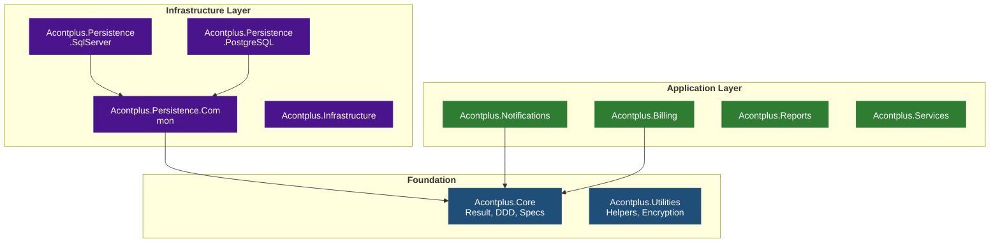
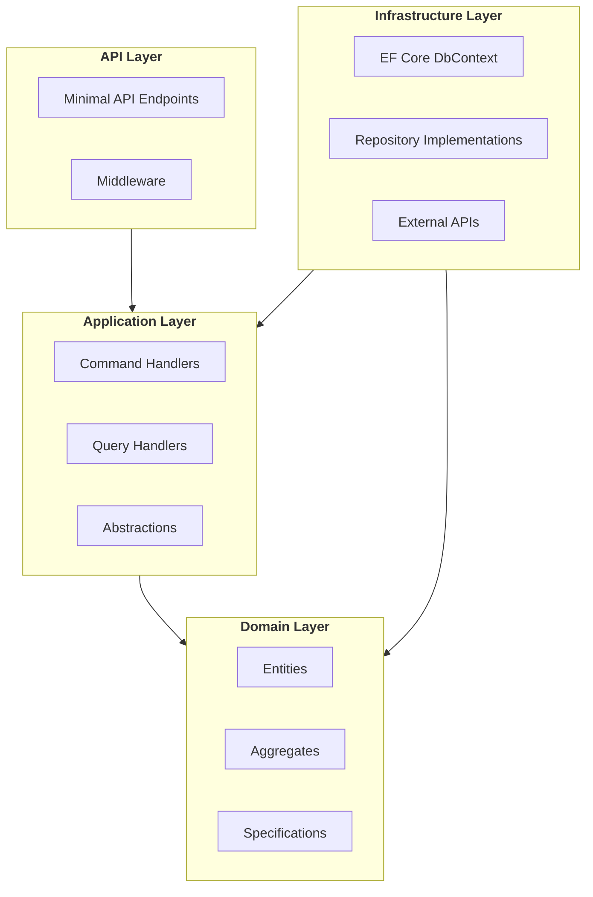

# Workflow: Generate Architecture Diagram (Mermaid)

Produce a Mermaid architecture diagram compatible with GitHub Wikis and GitHub-flavored Markdown.

## Step 1 — Gather Information

Ask the user for the following before generating:

1. **Subject** — which library, feature, or flow to diagram (e.g. `Acontplus.Notifications`, publishing pipeline, DDD layer relationships)
2. **Diagram type** — see options below; default: `flowchart TD`
3. **Level of detail** — high-level (packages only), mid-level (packages + key classes), or detailed (classes + methods)
4. **Output location** — inline in a README, new wiki page (`docs/wiki/<Name>.md`), or standalone `.md` file

---

## GitHub Wiki Compatibility Rules

1. Always wrap with ` ```mermaid ` fenced code block
2. No HTML inside node labels — avoid `<br>`, `<b>`. Use `\n` for line breaks in quoted labels
3. Quote node labels containing spaces, parentheses, or special characters: `A["My Label (v2)"]`
4. Node IDs: short, alphanumeric + underscores only — no spaces or hyphens: `acontplus_core`
5. Use `flowchart` not `graph`: `flowchart TD`
6. Subgraph titles: plain text, no quotes: `subgraph src[Source Libraries]`
7. Link labels: `-->|label|` syntax, keep labels short
8. Maximum ~50 nodes per diagram — split if larger
9. `classDef` for color-coding — define at bottom, apply with `:::className`
10. Every `subgraph` must have a closing `end`

---

## Mermaid v11+ Syntax Rules

Use **Mermaid v11+** syntax. Key rules for multi-line labels:

- **Preferred**: markdown strings with backtick syntax — supports real newlines, bold, italics, no HTML needed:
  ```
  A["`Acontplus.Core
  Result Pattern, DDD`"]
  ```
- **Alternative** when HTML labels are required: use `<br/>` inside double-quoted labels:
  ```
  A["Line 1<br/>Line 2"]
  ```
- **Never use `\n`** — it renders as literal text, not a newline
- Set `htmlLabels: false` in config when using markdown strings
- Node IDs: `[a-zA-Z0-9_]` only — no hyphens or spaces
- Use `flowchart`, not `graph`
- Every `subgraph` needs a closing `end`
- `classDef` at the bottom, apply with `:::className` or `class nodeId className`
- Max ~50 nodes per diagram — split if larger

---

## Diagram Type Reference

### Package Dependency Map (`flowchart TD`)

**Before drawing**: scan all `src/Acontplus.*/Acontplus.*.csproj` files and collect every `<ProjectReference>` and `<PackageReference Include="Acontplus.*">`. Build the graph from actual data.



### Request / Data Flow (`flowchart LR`)


### DDD Layer Diagram (`flowchart TD` with subgraphs)



### Sequence Diagram

```mermaid
sequenceDiagram
  autonumber
  actor User
  participant API as Demo.Api
  participant Svc as BillingService
  participant SRI as SRI Gateway

  User->>API: POST /api/invoices
  API->>Svc: CreateInvoiceAsync(request)
  Svc->>SRI: SignXml + Submit
  SRI-->>Svc: Authorization response
  Svc-->>API: Result&lt;Invoice&gt;
  API-->>User: 201 Created
```

---

## Output Format

For wiki pages (`docs/wiki/<Name>.md`):

````markdown
# <Title>

<One paragraph describing what this diagram illustrates.>

## Diagram

```mermaid
<diagram here>
```
````

## Notes

- Note 1
- Note 2

```

For inline in README: place after the Features section, before API Reference.

---

## Quality Checklist

- [ ] Diagram renders without syntax errors
- [ ] All node labels quoted if they contain spaces/special chars
- [ ] Node IDs use only `[a-zA-Z0-9_]`
- [ ] Every `subgraph` has a matching `end`
- [ ] `classDef` uses readable contrast (dark bg + white text)
- [ ] No HTML tags inside node labels
- [ ] Diagram has ≤ ~50 nodes; split if larger
- [ ] Package dependency graph was built from actual `.csproj` files, not guessed
- [ ] File saved to the agreed location
```
