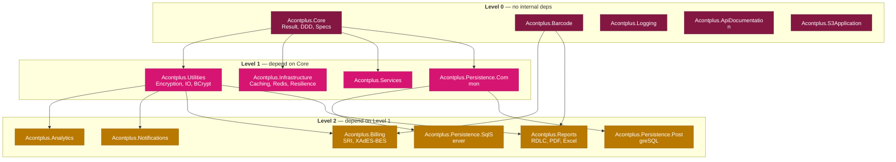
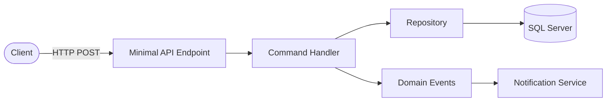
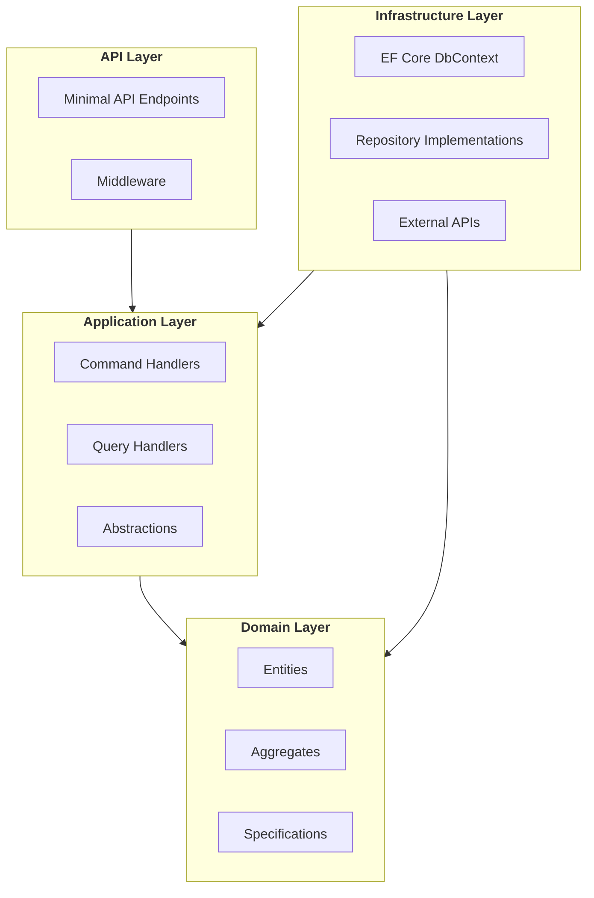

# Workflow: Generate Architecture Diagram (Mermaid)

Produce a Mermaid architecture diagram compatible with GitHub Wikis and GitHub-flavored Markdown.

## Step 1 — Gather Information

Ask the user for the following before generating:

1. **Subject** — which library, feature, or flow to diagram (e.g. `Acontplus.Notifications`, publishing pipeline, DDD layer relationships)
2. **Diagram type** — see options below; default: `flowchart TD`
3. **Level of detail** — high-level (packages only), mid-level (packages + key classes), or detailed (classes + methods)
4. **Output location** — inline in a README, new wiki page (`docs/wiki/<Name>.md`), or standalone `.md` file

---

## Mermaid v11+ Syntax Rules

Use **Mermaid v11+** syntax. Key rules for multi-line labels:

- **Preferred**: markdown strings with backtick syntax — supports real newlines, bold, italics, no HTML needed:
  ```
  A["`Acontplus.Core
  Result Pattern, DDD`"]
  ```
- **Alternative** when HTML labels are required: use `<br/>` inside double-quoted labels:
  ```
  A["Line 1<br/>Line 2"]
  ```
- **Never use `\n`** — it renders as literal text, not a newline
- Set `htmlLabels: false` in config when using markdown strings
- Node IDs: `[a-zA-Z0-9_]` only — no hyphens or spaces
- Use `flowchart`, not `graph`
- Every `subgraph` needs a closing `end`
- `classDef` at the bottom, apply with `:::className` or `class nodeId className`
- Max ~50 nodes per diagram — split if larger

---

## WHERE Diagrams Go

Before generating any diagram, choose the right output location:

| Subject                                                     | Location                                                    |
| ----------------------------------------------------------- | ----------------------------------------------------------- |
| Full monorepo dependency map                                | `docs/wiki/Architecture.md` — update existing page          |
| DDD layers (cross-cutting)                                  | `docs/wiki/Architecture.md`                                 |
| Package-specific internal structure (complex packages only) | `src/Acontplus.<Name>/README.md` after Features section     |
| New cross-cutting guide                                     | `docs/wiki/<NewTopic>.md` + add link to `docs/wiki/Home.md` |

**Packages that benefit from a README diagram** (non-obvious internal structure):
`Core`, `Billing`, `Infrastructure`, `Persistence.SqlServer`, `Persistence.PostgreSQL`, `Notifications`

**Packages where README diagrams add noise** (simple, obvious):
`Reports`, `Services`, `Utilities`, `Analytics`, `Barcode`, `Logging`, `S3Application`, `ApiDocumentation`, `Persistence.Common`

---

## Diagram Type Reference

### Package Dependency Map (`flowchart TD`)

**Before drawing**: scan all `src/Acontplus.*/Acontplus.*.csproj` files. Real dependency levels (never guess):

```
Level 0 (no internal deps): Core, Barcode, Logging, ApiDocumentation, S3Application
Level 1 (depend on Core):   Utilities, Infrastructure, Services, Persistence.Common
Level 2 (depend on L1):     Analytics, Notifications, Billing, Reports,
                             Persistence.SqlServer, Persistence.PostgreSQL
```

Critical facts:

- `Billing` → Utilities + Barcode (NOT Core directly)
- `Reports` → Utilities + Barcode (Level 2, NOT level 4)
- `Barcode` has zero internal dependencies (Level 0)
- `Analytics` and `Notifications` depend only on Utilities



### Request / Data Flow (`flowchart LR`)



### DDD Layer Diagram (`flowchart TD` with subgraphs)



### Sequence Diagram

```mermaid
sequenceDiagram
  autonumber
  actor User
  participant API as Demo.Api
  participant Svc as BillingService
  participant SRI as SRI Gateway

  User->>API: POST /api/invoices
  API->>Svc: CreateInvoiceAsync(request)
  Svc->>SRI: SignXml + Submit
  SRI-->>Svc: Authorization response
  Svc-->>API: Result&lt;Invoice&gt;
  API-->>User: 201 Created
```

---

## Output Format

For `docs/wiki/Architecture.md` — update the existing file, don't create a new one unless it's a genuinely new topic. Add as a new `## Section`.

For `src/Acontplus.<Name>/README.md` — place after `## Features`, before `## Usage Examples`. One sentence caption above the diagram. Keep ≤ ~20 nodes.

For a new wiki page (`docs/wiki/<NewTopic>.md`) — add `[[<NewTopic>]] — description` to the Guides list in `docs/wiki/Home.md`.

---

## Quality Checklist

- [ ] Dependencies verified from actual `.csproj` files
- [ ] `Billing` shows Utilities + Barcode deps (not Core directly)
- [ ] `Reports` shows Utilities + Barcode deps (Level 2, not Level 4)
- [ ] `Barcode` shown as Level 0 (no internal deps)
- [ ] Config block `htmlLabels: false` present when using markdown strings
- [ ] Node IDs alphanumeric + underscores only
- [ ] Every `subgraph` has a matching `end`
- [ ] ≤ ~50 nodes; split if larger
- [ ] Color palette consistent (blue L0 / green L1 / purple L2 / orange API)
- [ ] Output location matches the decision table
- [ ] If new wiki page: link added to `docs/wiki/Home.md`
