# 🧠 Smart Publish - Intelligent Flow

## ⚠️ Important: This Workflow Requires Manual Version Change

**smart-publish.yml** **detects** version changes that **have already been made** in your PR.

### How to Update Versions For This Workflow

**Step 1: Update version locally**
```powershell
# Option A: Use the automated script (RECOMMENDED)
.\upgrade-version.ps1 -PackageName Barcode -BumpType patch

# Option B: Edit Manually
# 1. Edit src/Acontplus.Barcode/Acontplus.Barcode.csproj
#    <Version>1.1.1</Version> → <Version>1.1.2</Version>
# 2. Edit Directory.Packages.props
#    <PackageVersion Include="Acontplus.Barcode" Version="1.1.2" />
```

**Step 2: Commit and push**
```bash
git add .
git commit -m "feat(barcode): add new QR format"
git push
```

**Step 3: Merge PR**
- smart-publish.yml detects the change in `.csproj`
- Analyzes if it has dependents
- Publishes automatically or recommends cascade

### Why Isn't It Automatic?

This workflow runs **after** the PR merge, when the code is already in `main`.
It canNot retroactively modify the PR, only detects and publishes changes already made.

**For automatic cascades**, use [`cascade-publish.yml`](CASCADE_PUBLISH_GUIDE.md) which does update versions automatically.

---

## 📊 Flow Diagram

```mermaid
graph TD
    A[PR Mergeado a main] --> B{smart-publish.yml}
    B --> C[Analyzesr cambios en .csproj]
    C --> D{Package has<br/>dependents??}

    D -->|No| E[✅ Simple Publishing]
    E --> F[Build & Tests]
    F --> G[Publish a NuGet.org]
    G --> H[Crear GitHub Release]
    H --> I[✅ Completado]

    D -->|Yes| J[⚠️ Cascade Recommended]
    J --> K[Crear Issue]
    K --> L[Comentar en PR]
    L --> M{Usuario Executes<br/>cascade-publish.yml}
    M --> N[Cascade Update]
    N --> O[Crea PR]
    O --> P[Review & Merge]
    P --> Q[pr-cascade-publish.yml]
    Q --> R[✅ Cascade Publishing]
```



## 🎯 Publishing Strategies

### ✅ Simple Publishing

**When to use:**
- Paquete No tiene dependents dentro del moNorepo
- Cambios aislados que No afectan otros packages

**Examples:**
- `Acontplus.Barcode` (no one depends on it)
- `Acontplus.S3Application` (standalone)
- `Acontplus.Logging` (sin dependents interNos)

**What it does:**
1. Detects version change
2. Runs tests
3. Publishes to NuGet.org
4. **Verifies indexing** (30s + 10 retries, ~130s total)
5. **Fails if canNot verify** (prevents later problems)
6. **Clears NuGet cache** before build to ensure correct versions
7. Creates GitHub release
8. ✅ Completed automatically

### ⚠️ Cascade Recommended

**When to use:**
- Paquete TIENE dependents dentro del moNorepo
- Changes that may affect other packages

**Examples:**
- `Acontplus.Core` (everyone depends on it)
- `Acontplus.Utilities` (muchos lo usan)
- `Acontplus.Persistence.Common` (tienen implementaciones)

**What it does:**
1. Detects version change
2. Analyzes dependents
3. Crea **issue** con:
   - List of dependent packages
   - Instructions for cascade
   - Suggested command
4. Comments on your PR
5. ⏸️ Waits for Manual developer action

## 📋 Real Examples

### Example 1: Update Barcode (Sin dependents)

**Pre-requisite: Update version locally**
```powershell
# On your local machine:
.\upgrade-version.ps1 -PackageName Barcode -BumpType patch
git add .
git commit -m "feat(barcode): add new QR format"
git push
# Create and merge PR
```

**Changes detected by smart-publish:**
```yaml
# src/Acontplus.Barcode/Acontplus.Barcode.csproj
<Version>1.1.1</Version> → <Version>1.1.2</Version>
```

**Result:**
```
1. Merge PR ✅ (with version already updated)
2. smart-publish.yml detects: No dependents
3. Automatically publishes a NuGet.org
4. Done! 🎉
```

### Example 2: Actualizar Core (With Dependents)

```yaml
# Cambios en src/Acontplus.Core/Acontplus.Core.csproj
<Version>2.1.0</Version> → <Version>2.2.0</Version>
```

**Result:**
```
1. Merge PR ✅
2. smart-publish.yml detects: HAS 12 dependents
3. Crea issue:

   "🔄 Cascade Update Recommended

   Acontplus.Core v2.2.0 tiene dependents:
   - Acontplus.Utilities
   - Acontplus.Services
   - Acontplus.Infrastructure
   - Acontplus.Persistence.Common
   - Acontplus.Billing
   - ... (8 more)

   Recommended action:
   1. Go to Actions → Cascade Publish
   2. Root Package: Core
   3. Bump Type: miNor
   4. Cascade Bump: patch
   5. Create PR: ✅ true"

4. ⏸️ Waits for your action
5. You run cascade-publish.yml Manually
6. PR is created with all changes
7. Review and merge
8. pr-cascade-publish.yml Publishes todo
```

### Example 3: Actualizar Utilities (Depends on Core)

```yaml
# Cambios en src/Acontplus.Utilities/Acontplus.Utilities.csproj
<Version>2.0.4</Version> → <Version>2.0.5</Version>
```

**Analysis:**
- Utilities Depends on Core ✅
- Billing, Reports, Notifications dependen de Utilities ⚠️

**Result:**
```
1. Merge PR ✅
2. smart-publish.yml detects: HAS 4 dependents
   - Acontplus.Billing
   - Acontplus.Reports
   - Acontplus.Notifications
   - Acontplus.Analytics
3. Creates issue with cascade recommendation
```

## 🔍 How It Works Internally

### Step 1: Change Detection

```powershell
# Detects modified .csproj files in the PR
$changedFiles = git diff --name-only HEAD~1 HEAD |
  Where-Object { $_ -like "src/*/*.csproj" }
```

### Step 2: Dependency Graph Construction

```powershell
# For each .csproj, extracts PackageReference
foreach ($project in $projectFiles) {
  [xml]$csproj = Get-Content $project.FullName
  $packageId = $csproj.Project.PropertyGroup.PackageId

  # Finds internal dependencies
  $deps = $csproj.Project.ItemGroup.PackageReference |
    Where-Object { $_.Include -like "Acontplus.*" }

  $dependencies[$packageId] = $deps
}
```

### Step 3: Dependency analysis

```powershell
# For each changed package, finds who depends on it
$dependents = $dependencies.Keys | Where-Object {
  $dependencies[$_] -contains $changedPackage
}

if ($dependents.Count -gt 0) {
  $strategy = "cascade"  # Recommend cascade
} else {
  $strategy = "simple"   # Publish directly
}
```

### Step 4: Strategy Execution

```yaml
# Conditional in workflow
simple-publish:
  if: needs.analyze-changes.outputs.cascade-needed == 'false'

trigger-cascade:
  if: needs.analyze-changes.outputs.cascade-needed == 'true'
```

## ⚙️ Configuration

### Zero Configuration Required

The workflow works automatically. No additional setup required beyond:

- ✅ `NUGET_API_KEY` configured in GitHub Secrets
- ✅ `GITHUB_TOKEN` (automatic)

### Disable Smart Publish (Optional)

If you prefer full Manual control, rename the workflow:

```bash
mv .github/workflows/smart-publish.yml \
   .github/workflows/smart-publish.yml.Disabled
```

## 📊 Workflow Comparison

| Feature | smart-publish | cascade-publish | nuget-publish |
|---------|--------------|-----------------|---------------|
| **Trigger** | Auto (PR merge) | Manual | Auto (PR merge) |
| **Analyzes deps** | ✅ Yes | ✅ Yes | ❌ No |
| **Auto decision** | ✅ Yes | ❌ Manual | ❌ No |
| **Publishes simple** | ✅ Yes | ❌ No | ✅ Yes |
| **Auto cascade** | ⚠️ Recommends | ✅ Executes | ❌ No |
| **Requires action** | Only if cascade | Always | No |
| **Tests** | ✅ Yes | ✅ Yes | ❌ No |

## 🎯 Recommendations

### ✅ DO's

- ✅ **Trust smart-publish** for automatic decisions
- ✅ **Sigue las Recommendations** from the created issue
- ✅ **Executes cascade** when instructed
- ✅ **Review the analysis** in the workflow logs

### ❌ DON'Ts

- ❌ **Don't igNore** issues de Cascade Recommended
- ❌ **Don't publish Manually** if smart-publish handles it
- ❌ **Don't disable** dependency analysis
- ❌ **Don't do cascade** if smart-publish says it's Not necessary

## 🐛 Troubleshooting

### Problem: "Publishing failed after de 10 retries"

**Causa**: NuGet.org is slow indexing the package

**Solution**:
1. The workflow stopped to prevent problems in later Builds
2. Verify manually in NuGet.org if the package is available
3. If the package appears on NuGet.org:
   - Wait 5-10 additional minutes
   - Re-run the workflow Manually if necessary
4. If the package DOES NoT appear:
   - Review logs of workflow for publishing errors
   - May be necessrio incrementar Version y Publishesr nuevamente

### Problem: "Smart-publish did Not execute"

**Causa**: The PR did Not modify files `.csproj` o `Directory.Packages.props`

**Solution**: Make sure to change the version in the `.csproj`

### Problem: "Detected dependents incorrectamente"

**Causa**: Outdated dependency graph

**Solution**:
```bash
# Verify Manually
.\batch-upgrade-version.ps1 -BumpType patch
```

### Problem: "Published when it should have cascaded"

**Causa**: The analysis did Not detect dependents (possible bug)

**Solution**: Executesr `cascade-publish.yml` manually to update

### Problem: "Issue was Not created"

**Causa**: GitHub Actions permissions

**Solution**: Settings → Actions → Permissions → Enable "Read and write"

## 📈 Statistics (For your info)

Based on your current moNorepo:

- **12 packages** With Dependents (require cascade)
- **2 packages** sin dependents (Simple Publishing)
- **Ahorro estimado**: 85% less Manual intervention

## 🔗 See Also

- [cascade-publish.yml](.github/workflows/cascade-publish.yml)
- [pr-cascade-publish.yml](.github/workflows/pr-cascade-publish.yml)
- [CASCADE_PUBLISH_GUIDE.md](../../docs/CASCADE_PUBLISH_GUIDE.md)

---

**Last updated**: Diciembre 2025


