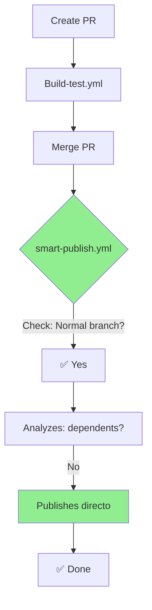
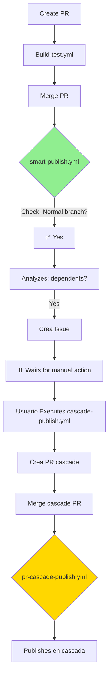
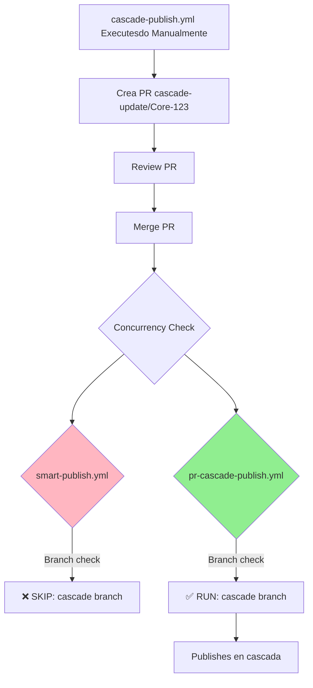

# 🔒 Workflow Conflict Resolution

## ⚠️ Original Problem Detected

Before the changes, there were **3 critical conflicts** that would cause duplicate publications:

### Conflicto 1: smart-publish vs nuget-publish
```
PR Merge → push a main
    ├─> smart-publish.yml Executes (trigger: PR closed)
    └─> nuget-publish.yml Executes (trigger: push)
    ❌ AMBOS Publishesn el mismo paquete
```

### Conflicto 2: smart-publish vs pr-cascade-publish
```
Cascade PR Merge
    ├─> smart-publish.yml Executes (trigger: PR closed)
    └─> pr-cascade-publish.yml Executes (trigger: PR closed)
    ❌ AMBOS intentan Publishesr
```

### Conflicto 3: Ejecuciones redundantes
```
Push a main
    ├─> Build-test.yml
    └─> nuget-publish.yml
(Ambos hacen Build, desperdiciando recursos)
```

---

## ✅ Implemented Solution

### 1. **Desactivar Trigger automatic de nuget-publish.yml**

```yaml
# ANTES (caused duplication):
on:
  push:
    branches: [main]
  workflow_dispatch:

# AHORA (Manual only):
on:
  # push: Disabled - conflicts with smart-publish.yml
  workflow_dispatch:
```

**Reason**: `nuget-publish.yml` is Now **LEGACY** and only used Manually in emergencies.

### 2. **Mutual Exclusion with Concurrency**

```yaml
# smart-publish.yml y pr-cascade-publish.yml
concurrency:
  group: publish-${{ github.event.pull_request.number }}
  cancel-in-progress: false
```

**How it works**:
- Both workflows use the same `group` key
- Si ambos se Executesn al mismo tiempo, GitHub Actions los serializa
- Only one runs at a time per PR

### 3. **Eligibility Check in smart-publish**

```yaml
jobs:
  check-eligibility:
    steps:
      - name: Check if this workflow should run
        run: |
          BRANCH_NAME="${{ github.event.pull_request.head.ref }}"

          # Skip if cascade branch
          if [[ "$BRANCH_NAME" == cascade-update/* ]]; then
            echo "should-run=false"
            exit 0
          fi
```

**Resultado**: smart-publish automatically skips if it detects branch `cascade-update/*`

### 4. **NuGet Indexing Protection**

**Problema detectado**: Si Core se Publishes pero NuGet demora en indexar, Utilities falla al hacer `dotnet restore`

**Implemented Solution en TODOS los workflows**:
```yaml
# Waits and verifies before continuing
- Wait: 30 seconds initial
- Retries: 10 attempts (10s each)
- Total max wait: ~130 seconds
- Behavior: STOPS cascade if verification fails
- Cache: Clears NuGet cache before restore
```

**Workflows protegidos**:
- ✅ `cascade-publish.yml` - Detiene cascada si falla Verification
- ✅ `pr-cascade-publish.yml` - Sale con error si falla Verification
- ✅ `smart-publish.yml` - Sale con error si falla Verification

**Directory.Packages.props Protection**:
- Only `cascade-publish.yml` updates Directory.Packages.props
- Other workflows only publish versions already updated in PRs

---

## 📊 Workflow Comparison: Version Updates

| Workflow | Requires Manual change? | Updates versions? | Updates Directory.Packages.props? | Tool |
|----------|-------------------------|----------------------|-------------------------------------|-------------|
| **cascade-publish.yml** | ❌ No | ✅ automatic | ✅ automatic | Workflow inputs |
| **smart-publish.yml** | ✅ Yes | ❌ Only detects | ❌ Only lee | `upgrade-version.ps1` |
| **pr-cascade-publish.yml** | ❌ No | ❌ Only lee | ❌ Only lee | N/A (reads what was updated) |
| **nuget-publish.yml** (LEGACY) | ✅ Yes | ❌ Only detects | ❌ Only lee | Manual o `upgrade-version.ps1` |

**Summary**:
- **cascade-publish.yml**: Completely automatic, do not touch code
- **smart-publish.yml**: Usa `.\upgrade-version.ps1` locally before PR
- **pr-cascade-publish.yml**: No action required, reads what cascade-publish updated

---

## 📊 Workflow Matrix (Post-Solution)

| Event | Build-test | smart-publish | pr-cascade | nuget-publish | cascade-publish |
|--------|-----------|---------------|------------|---------------|-----------------|
| **PR opened** | ✅ Validates | ❌ | ❌ | ❌ | ❌ |
| **Normal PR merge** | ✅ Build | ✅ Analyzes | ❌ Skipped | ❌ Disabled | ❌ |
| **Cascade PR merge** | ✅ Build | ❌ Skipped | ✅ Publishes | ❌ Disabled | ❌ |
| **Direct push to main** | ✅ Build | ❌ | ❌ | ❌ Disabled | ❌ |
| **Manual dispatch** | ✅ | ❌ | ❌ | ✅ Fallback | ✅ Cascade |

---

## 🎯 Guaranteed Conflict-Free Flows

### Flow 1: PR Normal con Paquete Sin dependents



**Workflows executed**:
1. ✅ `Build-test.yml` - Validates code
2. ✅ `smart-publish.yml` - Analyzes y Publishes
3. ❌ `nuget-publish.yml` - DESACTIVADO
4. ❌ `pr-cascade-publish.yml` - No es cascade branch

### Flow 2: PR Normal con Paquete With Dependents



**Workflows executed (First part)**:
1. ✅ `Build-test.yml` - Validates code
2. ✅ `smart-publish.yml` - Analyzes y Recommends
3. ❌ `nuget-publish.yml` - DESACTIVADO
4. ❌ `pr-cascade-publish.yml` - No es cascade branch

**Workflows executed (Second part - when merging cascade PR)**:
1. ✅ `Build-test.yml` - Validates code
2. ❌ `smart-publish.yml` - **Skipped** (detecta cascade branch)
3. ✅ `pr-cascade-publish.yml` - Publishes cascada
4. ❌ `nuget-publish.yml` - DESACTIVADO

### Flujo 3: Cascade PR (Creado por cascade-publish.yml)



**Workflows executed**:
1. ✅ `Build-test.yml` - Validates code
2. ❌ `smart-publish.yml` - **Skipped** por check de eligibilidad
3. ✅ `pr-cascade-publish.yml` - Handles publishing
4. ❌ `nuget-publish.yml` - DESACTIVADO

---

## 🔐 Protection Mechanisms

### 1. Concurrency Control

```yaml
concurrency:
  group: publish-${{ github.event.pull_request.number }}
  cancel-in-progress: false
```

**Previene**:
- ✅ Simultaneous executions del mismo PR
- ✅ Race conditions in publishing
- ✅ Version conflicts en NuGet

### 2. Branch Name Detection

```bash
if [[ "$BRANCH_NAME" == cascade-update/* ]]; then
  # Skip smart-publish
fi
```

**Previene**:
- ✅ smart-publish procesando cascade PRs
- ✅ Duplication of analysis
- ✅ Publishesciones dobles

### 3. Workflow Dispatch Only (nuget-publish)

```yaml
on:
  workflow_dispatch:  # Manual only
```

**Previene**:
- ✅ Conflicting automatic executions
- ✅ Publishesciones No deseadas
- ⚠️ Mantiene Fallback para emergencias

### 4. Conditional Execution

```yaml
if: needs.check-eligibility.outputs.should-run == 'true'
```

**Previene**:
- ✅ Jobs running innecesariamente
- ✅ Desperdicio de CI/CD minutos
- ✅ Logs confusos

---

## 📋 Verification de Conflictos

### Test Matrix

| Scenario | Expected Workflows | Verified ✅ |
|-----------|-------------------|------------|
| PR Normal → Merge (sin deps) | Build-test + smart-publish (simple) | ✅ |
| PR Normal → Merge (con deps) | Build-test + smart-publish (issue) | ✅ |
| Cascade PR → Merge | Build-test + pr-cascade-publish | ✅ |
| Direct push to main | Build-test only | ✅ |
| Manual nuget-publish | nuget-publish only | ✅ |
| Manual cascade-publish | cascade-publish only | ✅ |

### Comandos de Verification

```bash
# Ver todos los workflows activos
gh workflow list

# View runs of a specific PR
gh run list --branch feature/test

# Ver logs de un run
gh run view <run-id> --log

# Verify triggers
cat .github/workflows/*.yml | grep -A5 "^on:"
```

---

## 🚨 Alertas de Seguridad

### ✅ Situaciones Seguras

- ✅ Multiple PRs mergeados al mismo tiempo
- ✅ Cascade PR merged during normal PR
- ✅ Manual executions during merges
- ✅ Build-test running with smart-publish

### ⚠️ Situations to Monitor

- ⚠️ Si modificas `concurrency.group` en workflows
- ⚠️ Si creas nuevos workflows con trigger `push: main`
- ⚠️ Si cambias el prefijo de branches cascade

### ❌ Nunca Hagas Esto

- ❌ Re-activar `push` trigger en `nuget-publish.yml`
- ❌ Quitar `concurrency` de los workflows
- ❌ Eliminar check de `cascade-update/*` en smart-publish
- ❌ Modificar `should-run` sin entender el flujo completo

---

## 🐛 Troubleshooting

### Problem: "Ambos workflows se Executesron"

**Diagnosis**:
```bash
# Ver Workflows executed para un PR
gh run list --workflow=smart-publish.yml --branch=<branch-name>
gh run list --workflow=pr-cascade-publish.yml --branch=<branch-name>
```

**Solution**: Verify that both have the same `concurrency.group`

### Problem: "smart-publish published a cascade PR"

**Diagnosis**:
```bash
# Ver logs del check-eligibility job
gh run view <run-id> --log | grep "check-eligibility"
```

**Solution**: Verify that branch name has prefix `cascade-update/`

### Problem: "No workflow executed"

**Diagnosis**:
```bash
# Verify triggers
cat .github/workflows/smart-publish.yml | grep -A10 "^on:"
```

**Solution**: Ensure that the PR modified files in `src/**/*.csproj`

---

## 📚 Referencias

- [GitHub Actions Concurrency](https://docs.github.com/en/actions/using-jobs/using-concurrency)
- [Workflow Triggers](https://docs.github.com/en/actions/using-workflows/events-that-trigger-workflows)
- [Conditional Execution](https://docs.github.com/en/actions/using-workflows/workflow-syntax-for-github-actions#jobsjob_idif)

---

**Last updated**: Diciembre 2025
**Version**: 2.0 (Sin conflictos)


