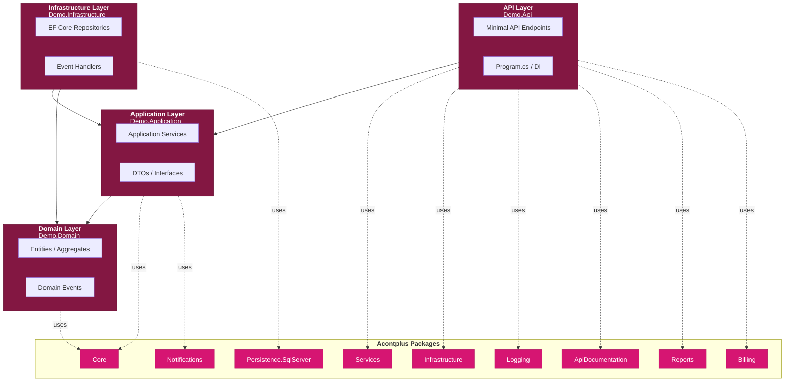
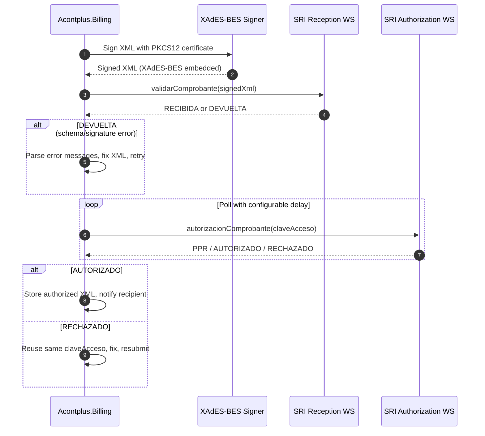
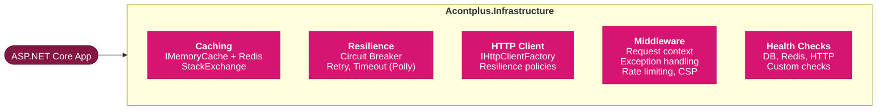
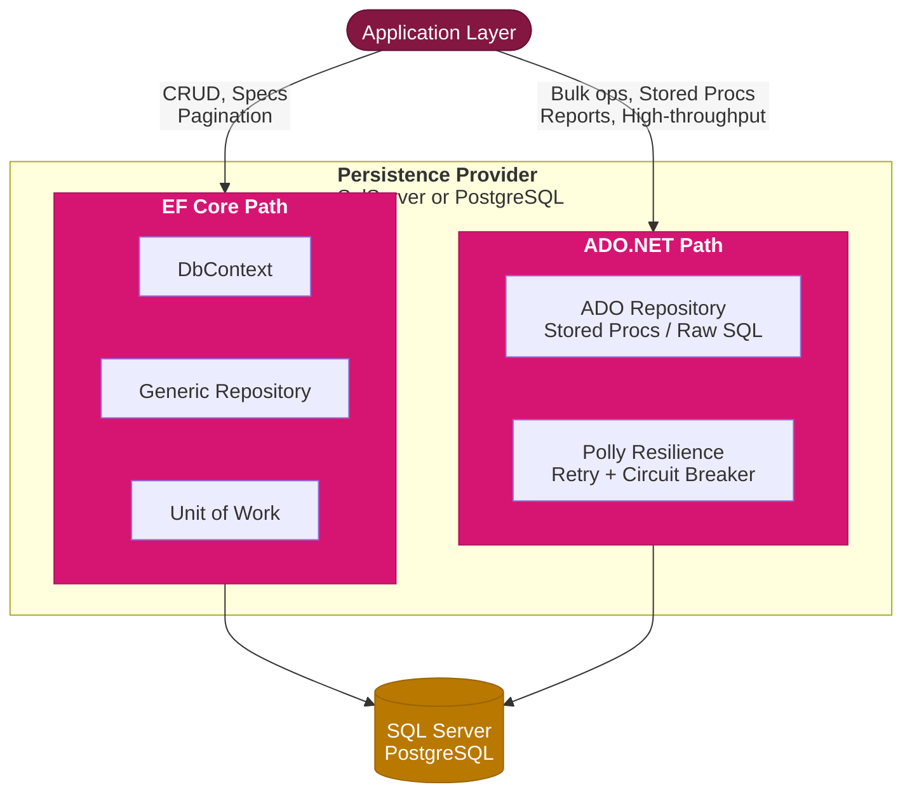

# Architecture

## Color Palette

All diagrams use the Acontplus brand palette:

| Role                      | Color                      | Hex       |
| ------------------------- | -------------------------- | --------- |
| Level 0 — Foundation      | Maroon (brand dark)        | `#831742` |
| Level 1 — Core dependents | Magenta (brand primary)    | `#d61572` |
| Level 2 — Application     | Amber (brand accent)       | `#b97800` |
| API / Host layer          | Sky blue (brand secondary) | `#0a7db5` |
| Success / positive        | Brand green                | `#0a8f64` |

---

## Package Dependency Map

```mermaid
---
config:
  htmlLabels: false
---
flowchart TD
  subgraph l0["`**Level 0** — no internal dependencies`"]
    direction LR
    Core["`**Acontplus.Core**
    Result&lt;T&gt;, DDD, Enums
    Specs, Validation`"]
    Barcode["`**Acontplus.Barcode**
    QR, Code128, ZXing
    SkiaSharp rendering`"]
    Logging["`**Acontplus.Logging**
    Serilog, OpenTelemetry
    Jaeger, Prometheus`"]
    ApiDocs["`**Acontplus.ApiDocumentation**
    Swagger, Versioning
    OpenAPI`"]
    S3["`**Acontplus.S3Application**
    AWS S3, Presigned URLs
    Polly resilience`"]
  end

  subgraph l1["`**Level 1** — depend on Core`"]
    direction LR
    Utilities["`**Acontplus.Utilities**
    Encryption, IO, Text
    Time, BCrypt`"]
    Infrastructure["`**Acontplus.Infrastructure**
    Caching, Redis, Resilience
    Middleware, HealthChecks`"]
    Services["`**Acontplus.Services**
    JWT Auth, User Context
    Security Headers`"]
    PersCommon["`**Acontplus.Persistence.Common**
    Repository abstractions
    EF Core, DbContextFactory`"]
  end

  subgraph l2["`**Level 2** — depend on Level 1`"]
    direction LR
    Analytics["`**Acontplus.Analytics**
    Metrics, KPIs
    Business Intelligence`"]
    Notifications["`**Acontplus.Notifications**
    Email SMTP/SES
    WhatsApp Cloud API`"]
    Billing["`**Acontplus.Billing**
    SRI Electronic Invoicing
    XAdES-BES Signature`"]
    Reports["`**Acontplus.Reports**
    RDLC, QuestPDF
    Excel MiniExcel/ClosedXML`"]
    PersSQL["`**Acontplus.Persistence
    .SqlServer**
    EF Core + ADO.NET`"]
    PersPG["`**Acontplus.Persistence
    .PostgreSQL**
    EF Core + Npgsql`"]
  end

  Core --> Utilities
  Core --> Infrastructure
  Core --> Services
  Core --> PersCommon
  Barcode --> Billing
  Barcode --> Reports
  Utilities --> Analytics
  Utilities --> Notifications
  Utilities --> Billing
  Utilities --> Reports
  PersCommon --> PersSQL
  PersCommon --> PersPG

  classDef l0 fill:#831742,color:#fff,stroke:#6a1235
  classDef l1 fill:#d61572,color:#fff,stroke:#b01260
  classDef l2 fill:#b97800,color:#fff,stroke:#9a6400
  class Core,Barcode,Logging,ApiDocs,S3 l0
  class Utilities,Infrastructure,Services,PersCommon l1
  class Analytics,Notifications,Billing,Reports,PersSQL,PersPG l2
```

How the 15 NuGet packages depend on each other — built from actual `.csproj` `<PackageReference Include="Acontplus.*">` entries.

### Key observations

- **Core** and **Barcode** are fully independent — zero internal deps. Safe to install in any host (console, worker, API).
- **Billing** depends on `Utilities + Barcode` — not Core directly (Utilities transitively brings Core).
- **Reports** depends on `Utilities + Barcode` — same level as Billing, not a deeper tier.
- **Logging, ApiDocumentation, S3Application** are standalone — install without pulling any other Acontplus package.
- **Persistence.SqlServer** and **Persistence.PostgreSQL** are parallel — never reference both in the same project.

---

## Demo Application — Clean Architecture Layers

How `apps/src/Demo.*` maps to DDD layers and which packages each layer consumes.

---

## SRI Billing — Authorization Flow

The async document authorization flow required by SRI Ecuador. See [[SRI-Electronic-Billing-Spec]] for full protocol details.

---

## Infrastructure — Subsystem Map

`Acontplus.Infrastructure` bundles 5 distinct subsystems. Install it when you need any of them.

---

## Persistence — Dual Access Pattern

Both `Persistence.SqlServer` and `Persistence.PostgreSQL` expose two access patterns. Choose based on the operation type.

Use **EF Core** for: standard CRUD, specification queries, pagination, domain queries.
Use **ADO.NET** for: stored procedures, bulk inserts, raw SQL reports, high-throughput operations.
