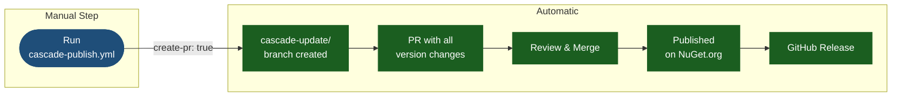

# Cascade Publish Guide

How to use the automated cascade publishing workflows for Acontplus libraries.

---

## Do I Need to Manually Change Versions?

### Using `cascade-publish.yml` — No manual changes needed

This workflow is **fully automatic**. Just provide inputs:

```
root-package: Core
bump-type: patch
cascade-bump: patch
```

The workflow calculates new versions, updates all `.csproj` files, updates `Directory.Packages.props`, and creates a PR automatically.

### Using `smart-publish.yml` — Manual version change required

You must update versions locally first, then open a PR:

```powershell
.\upgrade-version.ps1 -PackageName Core -BumpType patch
git add .
git commit -m "feat(core): add new feature"
git push
# Open PR → merge → smart-publish.yml detects and publishes
```

---

## Available Workflows

### `cascade-publish.yml` — Manual Cascade

Calculates the dependency graph and updates all affected packages in topological order.

**Trigger**: Manual (GitHub → Actions → Cascade Publish NuGet Packages)

**Parameters**:

| Parameter      | Description                                               | Default  |
| -------------- | --------------------------------------------------------- | -------- |
| `root-package` | Root package short name (e.g. `Core`)                     | required |
| `bump-type`    | Version bump for root: `major` / `minor` / `patch`        | `patch`  |
| `cascade-bump` | Bump for dependents: `major` / `minor` / `patch` / `none` | `patch`  |
| `run-tests`    | Run tests before publishing                               | `true`   |
| `dry-run`      | Simulate without publishing                               | `false`  |

**What it does automatically**:

- Calculates new version from bump type
- Updates `<Version>` in each affected `.csproj`
- Updates `Directory.Packages.props`
- Builds and tests each package
- Packs and publishes to NuGet.org
- Pushes version changes to a `cascade-update/` branch
- Creates a GitHub Release

### `smart-publish.yml` — Auto on PR Merge

Triggered automatically when a PR modifying `.csproj` or `Directory.Packages.props` is merged to `main`.

- If package has **no dependents** → publishes directly
- If package **has dependents** → creates a GitHub issue recommending `cascade-publish.yml`

### `build-test.yml` — CI Validation

Runs on every branch and PR: build, test, version format validation, pack verification.

### `version-check.yml` — Daily Monitoring

Runs daily at 9 AM UTC. Compares local versions with NuGet.org and opens issues for unpublished versions.

---

## Recommended Flow

### Safe Flow (recommended for all production changes)



**Steps**:

1. Go to **Actions → Cascade Publish NuGet Packages → Run workflow**
2. Fill in parameters (see table above)
3. A `cascade-update/` branch and PR are created automatically
4. Review the PR — verify version bumps and `Directory.Packages.props`
5. Merge the PR
6. Publishing completes automatically

---

## Use Cases

### Case 1: Minor feature in Core

```
root-package: Core
bump-type: minor    (2.1.0 → 2.2.0)
cascade-bump: patch
```

All dependents receive a patch bump.

### Case 2: Bugfix in Utilities, no cascade needed

```
root-package: Utilities
bump-type: patch
cascade-bump: none   ← key
```

Only Utilities is updated.

### Case 3: Breaking change in Core

```
root-package: Core
bump-type: major    (2.x.x → 3.0.0)
cascade-bump: major
```

All dependents move to major as well.

### Case 4: Dry run first

```
root-package: Core
bump-type: minor
dry-run: true        ← no real changes, logs only
```

---

## Required Secrets

| Secret         | Source                  | Purpose                         |
| -------------- | ----------------------- | ------------------------------- |
| `NUGET_USER`   | Your NuGet.org username | NuGet Trusted Publishing (OIDC) |
| `GITHUB_TOKEN` | Automatic               | Creating PRs, releases, issues  |

`NUGET_API_KEY` is **not needed** — authentication uses NuGet Trusted Publishing (OIDC), which issues a short-lived key automatically at publish time.

### Configure Trusted Publishing on NuGet.org

1. Go to [nuget.org → Account → Trusted Publishing](https://www.nuget.org/account/trustedpublishers)
2. Add policy:
   - Package Owner: `acontplus`
   - Repository Owner: `acontplus`
   - Repository: `acontplus-dotnet-libs`
   - Workflow File: `smart-publish.yml`
   - Environment: `production`
3. Add `NUGET_USER` secret in GitHub repo settings

---

## Troubleshooting

| Problem                          | Cause                                 | Solution                                                            |
| -------------------------------- | ------------------------------------- | ------------------------------------------------------------------- |
| Tests failed                     | Test failure in cascade               | Fix tests locally, re-run                                           |
| Package already published        | Version already on NuGet.org          | Increment version with script                                       |
| NuGet indexing timeout           | NuGet.org slow                        | Workflow waits 30s + 20 retries; check NuGet manually then retry    |
| PR merge doesn't trigger publish | Branch lacks `cascade-update/` prefix | Use `cascade-publish.yml` to create the PR                          |
| Build failed in cascade          | Compile error                         | Workflow creates an issue; fix error and re-run from failed package |

---

## Best Practices

**Do:**

- Always use `create-pr: true` for production changes
- Run `dry-run: true` first when unsure
- Follow Semantic Versioning strictly
- Wait for the full workflow to complete before starting another cascade

**Don't:**

- Run multiple cascades simultaneously
- Manually edit `.csproj` versions while a cascade is running
- Merge a cascade PR if it has conflicts
