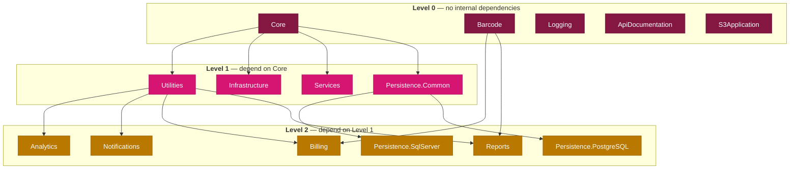

# Acontplus .NET Libraries

Welcome to the documentation wiki for the Acontplus .NET Libraries monorepo — 15 NuGet packages for .NET 10, following Clean Architecture and DDD patterns.

> **Repository**: [acontplus/acontplus-dotnet-libs](https://github.com/acontplus/acontplus-dotnet-libs)

---

## 📦 Package Documentation

| Package                                                                                                                               | Description                                                       |
| ------------------------------------------------------------------------------------------------------------------------------------- | ----------------------------------------------------------------- |
| [Acontplus.Core](https://github.com/acontplus/acontplus-dotnet-libs/tree/main/src/Acontplus.Core)                                     | Domain primitives, Result&lt;T&gt; pattern, specifications, enums |
| [Acontplus.Utilities](https://github.com/acontplus/acontplus-dotnet-libs/tree/main/src/Acontplus.Utilities)                           | Helpers, encryption, string extensions                            |
| [Acontplus.Infrastructure](https://github.com/acontplus/acontplus-dotnet-libs/tree/main/src/Acontplus.Infrastructure)                 | Caching, Redis, resilience, middleware, health checks             |
| [Acontplus.Persistence.Common](https://github.com/acontplus/acontplus-dotnet-libs/tree/main/src/Acontplus.Persistence.Common)         | Repository abstractions, EF Core, DbContextFactory                |
| [Acontplus.Persistence.SqlServer](https://github.com/acontplus/acontplus-dotnet-libs/tree/main/src/Acontplus.Persistence.SqlServer)   | EF Core + ADO.NET for SQL Server                                  |
| [Acontplus.Persistence.PostgreSQL](https://github.com/acontplus/acontplus-dotnet-libs/tree/main/src/Acontplus.Persistence.PostgreSQL) | EF Core + ADO.NET for PostgreSQL                                  |
| [Acontplus.Notifications](https://github.com/acontplus/acontplus-dotnet-libs/tree/main/src/Acontplus.Notifications)                   | Email SMTP/SES, WhatsApp Cloud API, Scriban templates             |
| [Acontplus.Billing](https://github.com/acontplus/acontplus-dotnet-libs/tree/main/src/Acontplus.Billing)                               | SRI electronic invoicing, XAdES-BES signature                     |
| [Acontplus.Reports](https://github.com/acontplus/acontplus-dotnet-libs/tree/main/src/Acontplus.Reports)                               | RDLC, QuestPDF, Excel (MiniExcel/ClosedXML)                       |
| [Acontplus.Services](https://github.com/acontplus/acontplus-dotnet-libs/tree/main/src/Acontplus.Services)                             | JWT auth, user context, security headers                          |
| [Acontplus.Analytics](https://github.com/acontplus/acontplus-dotnet-libs/tree/main/src/Acontplus.Analytics)                           | Metrics, KPIs, business intelligence                              |
| [Acontplus.Logging](https://github.com/acontplus/acontplus-dotnet-libs/tree/main/src/Acontplus.Logging)                               | Serilog + OpenTelemetry (Jaeger, Prometheus, ELK)                 |
| [Acontplus.Barcode](https://github.com/acontplus/acontplus-dotnet-libs/tree/main/src/Acontplus.Barcode)                               | QR/barcode generation (ZXing + SkiaSharp)                         |
| [Acontplus.S3Application](https://github.com/acontplus/acontplus-dotnet-libs/tree/main/src/Acontplus.S3Application)                   | AWS S3 storage, presigned URLs                                    |
| [Acontplus.ApiDocumentation](https://github.com/acontplus/acontplus-dotnet-libs/tree/main/src/Acontplus.ApiDocumentation)             | Swagger/OpenAPI + API versioning                                  |

---

## 📖 Guides

- [[Architecture]] — Package dependency map, DDD layers, SRI billing flow, persistence patterns
- [[Cascade-Publish-Guide]] — How to publish packages with dependencies in topological order
- [[Smart-Publish-Guide]] — How the automatic PR-merge publishing flow works
- [[Persistence-Resilience-Guide]] — Configuring retry, circuit breaker, and timeout policies
- [[SRI-Electronic-Billing-Spec]] — SRI electronic billing technical spec (Ficha Técnica v2.32, Ecuador)

---

## 🔄 Version Cascade Order

When bumping versions, always publish dependencies before dependents. Built from actual `.csproj` references — **not** a diagram of intent.

Key: `Reports` is Level 2 (not 4) — it depends on `Utilities` + `Barcode`, both of which are Level 0/1. Full diagrams: [[Architecture]]
