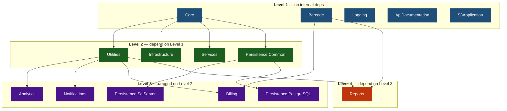

# Acontplus .NET Libraries

Welcome to the documentation wiki for the Acontplus .NET Libraries monorepo — 13 NuGet packages for .NET 10, following Clean Architecture and DDD patterns.

> **Repository**: [acontplus/acontplus-dotnet-libs](https://github.com/acontplus/acontplus-dotnet-libs)

---

## 📦 Package Documentation

| Package                                                                                                                               | Description                                                       |
| ------------------------------------------------------------------------------------------------------------------------------------- | ----------------------------------------------------------------- |
| [Acontplus.Core](https://github.com/acontplus/acontplus-dotnet-libs/tree/main/src/Acontplus.Core)                                     | Domain primitives, Result&lt;T&gt; pattern, specifications, enums |
| [Acontplus.Utilities](https://github.com/acontplus/acontplus-dotnet-libs/tree/main/src/Acontplus.Utilities)                           | Helpers, encryption, string extensions                            |
| [Acontplus.Infrastructure](https://github.com/acontplus/acontplus-dotnet-libs/tree/main/src/Acontplus.Infrastructure)                 | Cross-cutting infrastructure concerns                             |
| [Acontplus.Persistence.Common](https://github.com/acontplus/acontplus-dotnet-libs/tree/main/src/Acontplus.Persistence.Common)         | Repository abstractions                                           |
| [Acontplus.Persistence.SqlServer](https://github.com/acontplus/acontplus-dotnet-libs/tree/main/src/Acontplus.Persistence.SqlServer)   | EF Core + SQL Server                                              |
| [Acontplus.Persistence.PostgreSQL](https://github.com/acontplus/acontplus-dotnet-libs/tree/main/src/Acontplus.Persistence.PostgreSQL) | EF Core + PostgreSQL                                              |
| [Acontplus.Notifications](https://github.com/acontplus/acontplus-dotnet-libs/tree/main/src/Acontplus.Notifications)                   | Email, WhatsApp, SMS, templates                                   |
| [Acontplus.Billing](https://github.com/acontplus/acontplus-dotnet-libs/tree/main/src/Acontplus.Billing)                               | Electronic invoicing, SRI integration                             |
| [Acontplus.Reports](https://github.com/acontplus/acontplus-dotnet-libs/tree/main/src/Acontplus.Reports)                               | RDLC reports, PDF generation                                      |
| [Acontplus.Services](https://github.com/acontplus/acontplus-dotnet-libs/tree/main/src/Acontplus.Services)                             | Caching, auth middleware                                          |
| [Acontplus.Analytics](https://github.com/acontplus/acontplus-dotnet-libs/tree/main/src/Acontplus.Analytics)                           | Analytics support                                                 |
| [Acontplus.Logging](https://github.com/acontplus/acontplus-dotnet-libs/tree/main/src/Acontplus.Logging)                               | Serilog configuration                                             |
| [Acontplus.Barcode](https://github.com/acontplus/acontplus-dotnet-libs/tree/main/src/Acontplus.Barcode)                               | QR/barcode generation                                             |
| [Acontplus.S3Application](https://github.com/acontplus/acontplus-dotnet-libs/tree/main/src/Acontplus.S3Application)                   | AWS S3 storage                                                    |
| [Acontplus.ApiDocumentation](https://github.com/acontplus/acontplus-dotnet-libs/tree/main/src/Acontplus.ApiDocumentation)             | Swagger/OpenAPI setup                                             |

---

## 📖 Guides

- [[Cascade-Publish-Guide]] — How to publish packages with dependencies in topological order
- [[Smart-Publish-Guide]] — How the automatic PR-merge publishing flow works
- [[Persistence-Resilience-Guide]] — Configuring retry, circuit breaker, and timeout policies
- [[SRI-Electronic-Billing-Spec]] — SRI electronic billing technical spec (Ficha Técnica v2.32, Ecuador)

---

## 🔄 Version Cascade Order

When bumping versions, always update from base to dependents — never update a dependent before its dependency is published.

---

## 🏢 About Acontplus

[Acontplus](https://www.acontplus.com) is a leading provider of software solutions in Ecuador, specializing in digital transformation, electronic invoicing, secure integrations, and business process automation.
