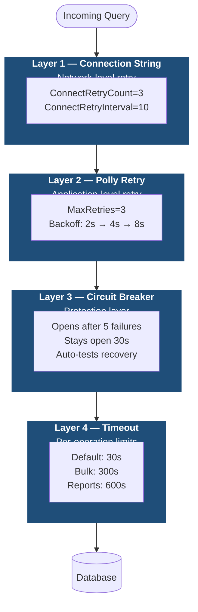

# Persistence Resilience Guide

How to configure retry policies, circuit breakers, and timeouts for `Acontplus.Persistence.SqlServer` and `Acontplus.Persistence.PostgreSQL`.

---

## Overview

The ADO.NET repositories support **dynamic resilience configuration** via `appsettings.json`. No code changes are required — add the configuration section and the behavior changes at runtime.

### Key Features

- Dynamic configuration via `appsettings.json` — no recompile needed
- Sensible defaults — works without any configuration
- Multi-layered resilience: connection string + Polly retry + circuit breaker + timeouts
- Environment-specific: different settings per environment
- Backward compatible: zero breaking changes

---

## Configuration Structure

```json
{
  "Persistence": {
    "Resilience": {
      "RetryPolicy": {
        "Enabled": true,
        "MaxRetries": 3,
        "BaseDelaySeconds": 2,
        "ExponentialBackoff": true,
        "MaxDelaySeconds": 30
      },
      "CircuitBreaker": {
        "Enabled": true,
        "ExceptionsAllowedBeforeBreaking": 5,
        "DurationOfBreakSeconds": 30,
        "SamplingDurationSeconds": 60,
        "MinimumThroughput": 10
      },
      "Timeout": {
        "Enabled": true,
        "DefaultCommandTimeoutSeconds": 30,
        "ComplexQueryTimeoutSeconds": 60,
        "BulkOperationTimeoutSeconds": 300,
        "LongRunningQueryTimeoutSeconds": 600
      }
    }
  }
}
```

---

## Configuration Reference

### RetryPolicy

| Option               | Type | Default | Description                            |
| -------------------- | ---- | ------- | -------------------------------------- |
| `Enabled`            | bool | `true`  | Enable/disable retry                   |
| `MaxRetries`         | int  | `3`     | Max retry attempts                     |
| `BaseDelaySeconds`   | int  | `2`     | Base delay — backoff yields 2s, 4s, 8s |
| `ExponentialBackoff` | bool | `true`  | Exponential vs fixed delay             |
| `MaxDelaySeconds`    | int  | `30`    | Cap for exponential delay              |

### CircuitBreaker

| Option                            | Type | Default | Description                          |
| --------------------------------- | ---- | ------- | ------------------------------------ |
| `Enabled`                         | bool | `true`  | Enable/disable circuit breaker       |
| `ExceptionsAllowedBeforeBreaking` | int  | `5`     | Failures before circuit opens        |
| `DurationOfBreakSeconds`          | int  | `30`    | How long circuit stays open          |
| `SamplingDurationSeconds`         | int  | `60`    | Time window for failure tracking     |
| `MinimumThroughput`               | int  | `10`    | Min requests before circuit can open |

### Timeout

| Option                           | Type | Default | Description                   |
| -------------------------------- | ---- | ------- | ----------------------------- |
| `Enabled`                        | bool | `true`  | Enable/disable timeouts       |
| `DefaultCommandTimeoutSeconds`   | int  | `30`    | Default query timeout         |
| `ComplexQueryTimeoutSeconds`     | int  | `60`    | Complex query timeout         |
| `BulkOperationTimeoutSeconds`    | int  | `300`   | Bulk insert timeout (5 min)   |
| `LongRunningQueryTimeoutSeconds` | int  | `600`   | Report query timeout (10 min) |

---

## Multi-Layer Resilience



### Why all four layers?

| Scenario                | Connection String | Polly Retry | Circuit Breaker  |
| ----------------------- | :---------------: | :---------: | :--------------: |
| Network blip at connect |        ✅         |     ✅      |        —         |
| Query deadlock          |        ❌         |     ✅      |        —         |
| DB overloaded           |        ❌         |     ✅      | ✅ stops cascade |
| Transient timeout       |        ❌         |     ✅      |        —         |

---

## Environment-Specific Configs

### Development (lenient — fast feedback)

```json
{
  "Persistence": {
    "Resilience": {
      "RetryPolicy": {
        "Enabled": true,
        "MaxRetries": 2,
        "BaseDelaySeconds": 1,
        "ExponentialBackoff": false
      },
      "CircuitBreaker": { "Enabled": false }
    }
  }
}
```

### Production (strict)

```json
{
  "Persistence": {
    "Resilience": {
      "RetryPolicy": {
        "Enabled": true,
        "MaxRetries": 3,
        "BaseDelaySeconds": 2,
        "ExponentialBackoff": true,
        "MaxDelaySeconds": 30
      },
      "CircuitBreaker": {
        "Enabled": true,
        "ExceptionsAllowedBeforeBreaking": 5,
        "DurationOfBreakSeconds": 30
      }
    }
  }
}
```

### High-volume production

```json
{
  "Persistence": {
    "Resilience": {
      "RetryPolicy": {
        "Enabled": true,
        "MaxRetries": 5,
        "BaseDelaySeconds": 2,
        "ExponentialBackoff": true,
        "MaxDelaySeconds": 60
      },
      "CircuitBreaker": {
        "Enabled": true,
        "ExceptionsAllowedBeforeBreaking": 10,
        "DurationOfBreakSeconds": 60,
        "MinimumThroughput": 100
      }
    }
  }
}
```

---

## Registration

### Automatic (via `AddInfrastructureServices`)

```csharp
// Program.cs
builder.Services.AddInfrastructureServices(builder.Configuration);
```

### Manual

```csharp
builder.Services.Configure<PersistenceResilienceOptions>(
    builder.Configuration.GetSection(PersistenceResilienceOptions.SectionName));

builder.Services.AddScoped<IAdoRepository, AdoRepository>();
```

---

## Monitoring

Retry attempts are logged automatically:

```
[ADO Repository] Retry 1/3 after 2000ms for SQL Server operation
System.Data.SqlClient.SqlException: Deadlock victim
```

Enable detailed logging:

```json
{
  "Logging": {
    "LogLevel": {
      "Acontplus.Persistence.SqlServer": "Debug",
      "Acontplus.Persistence.PostgreSQL": "Debug"
    }
  }
}
```

---

## Connection String Alignment

The `Command Timeout` in your connection string must be **≥** `DefaultCommandTimeoutSeconds`:

```
Server=.;Database=MyDb;
Pooling=true;Max Pool Size=300;Min Pool Size=30;
Connection Timeout=45;
ConnectRetryCount=3;ConnectRetryInterval=10;
Command Timeout=90;
```

---

## Troubleshooting

| Problem                           | Cause                      | Solution                                                          |
| --------------------------------- | -------------------------- | ----------------------------------------------------------------- |
| Retries not working               | `Enabled: false`           | Set `RetryPolicy.Enabled: true`                                   |
| Excessive retry delays            | `MaxDelaySeconds` too high | Reduce `MaxDelaySeconds` or disable `ExponentialBackoff`          |
| Timeout exceptions                | Timeout too low            | Increase `DefaultCommandTimeoutSeconds`                           |
| Circuit breaker opening too often | Threshold too low          | Increase `ExceptionsAllowedBeforeBreaking` or `MinimumThroughput` |

---

## Related

- [Polly Documentation](https://github.com/App-vNext/Polly)
- [SQL Server Transient Errors](https://learn.microsoft.com/azure/azure-sql/database/troubleshoot-common-errors-issues)
- [PostgreSQL Error Codes](https://www.postgresql.org/docs/current/errcodes-appendix.html)
