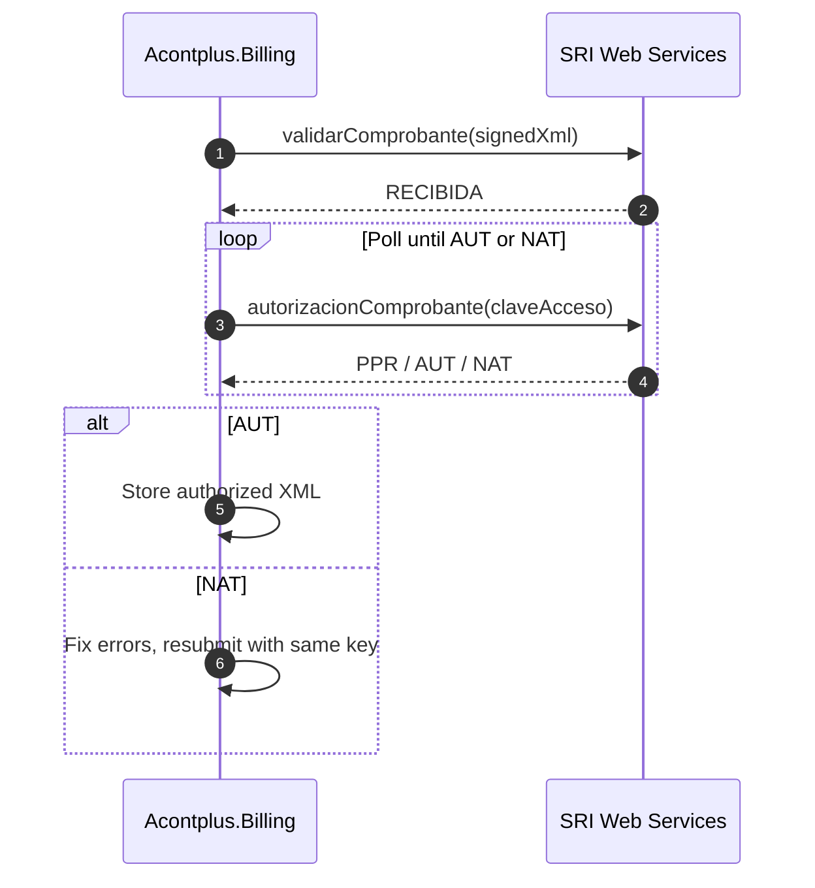

# SRI Electronic Billing Specification

Technical reference for electronic document authorization in Ecuador — **SRI Ficha Técnica v2.32** (October 2025).

Applies to: `Acontplus.Billing`

---

## Document Types

| Code | Document                                                  |
| ---- | --------------------------------------------------------- |
| `01` | Factura (Invoice)                                         |
| `03` | Liquidación de compra de bienes y prestación de servicios |
| `04` | Nota de Crédito                                           |
| `05` | Nota de Débito                                            |
| `06` | Guía de Remisión                                          |
| `07` | Comprobante de Retención                                  |

---

## Access Key — 49 digits

Every document has a unique 49-digit numeric key that also serves as its authorization number.

| Position | Field                                 | Length |
| -------- | ------------------------------------- | ------ |
| 1–8      | Issue date `ddmmyyyy`                 | 8      |
| 9–10     | Document type code                    | 2      |
| 11–23    | RUC (tax ID)                          | 13     |
| 24       | Environment: `1`=Test, `2`=Production | 1      |
| 25–30    | Series `001001`                       | 6      |
| 31–39    | Sequential `000000001`                | 9      |
| 40–47    | Numeric code (issuer-defined)         | 8      |
| 48       | Emission type: `1`=Normal             | 1      |
| 49       | Check digit (Modulo 11)               | 1      |

All fields must be **zero-padded to exact length**. Incorrect length = immediate rejection.

### Modulo 11 Check Digit

Apply weights `2,3,4,5,6,7` cycling right-to-left over 48 digits. Sum all products, compute `11 - (sum mod 11)`. If result is `11` → digit is `0`. If result is `10` → digit is `1`.

---

## Identification Types

| Code | Type                        | Notes                     |
| ---- | --------------------------- | ------------------------- |
| `04` | RUC                         |                           |
| `05` | Cédula                      |                           |
| `06` | Pasaporte                   |                           |
| `07` | Consumidor final            | Use `9999999999999` as ID |
| `08` | Identificación del exterior |                           |

Code `07` is **not allowed** in: Notas de Crédito, Notas de Débito, Comprobantes de Retención, Liquidaciones de compra.

If invoice total **> $50 USD**: buyer data is mandatory — cannot use consumidor final.

---

## Document States

| State | Meaning                                     |
| ----- | ------------------------------------------- |
| `PPR` | En procesamiento — awaiting validation      |
| `AUT` | Autorizado — legally valid                  |
| `NAT` | No autorizado — rejected, must be corrected |

When `NAT`: reuse the **same access key and sequential**, fix the error, resubmit.

---

## Tax Codes

### IVA (`codImpuesto = 2`)

| Code | Rate                  |
| ---- | --------------------- |
| `0`  | 0%                    |
| `2`  | 12%                   |
| `3`  | 14%                   |
| `4`  | 15%                   |
| `5`  | 5%                    |
| `6`  | No objeto de impuesto |
| `7`  | Exento de IVA         |
| `8`  | IVA diferenciado      |
| `10` | 13%                   |

### ICE (`codImpuesto = 3`) — rates from current SRI regulation

| Code   | Description                              |
| ------ | ---------------------------------------- |
| `3011` | Cigarrillos Rubios                       |
| `3021` | Cigarrillos Negros                       |
| `3023` | Productos del Tabaco excepto Cigarrillos |
| `3031` | Bebidas Alcohólicas                      |
| `3041` | Cerveza Industrial                       |
| `3073` | Vehículos ≤ $20,000 PVP                  |
| `3075` | Vehículos PVP $20,000–$30,000            |

---

## Authorization Flow

**The flow is asynchronous by spec.** Never call reception and authorization synchronously in sequence without delay.

---

## Web Service Endpoints

### Test (`celcer.sri.gob.ec`)

| Service       | URL                                                                                           |
| ------------- | --------------------------------------------------------------------------------------------- |
| Reception     | `https://celcer.sri.gob.ec/comprobantes-electronicos-ws/RecepcionComprobantesOffline?wsdl`    |
| Authorization | `https://celcer.sri.gob.ec/comprobantes-electronicos-ws/AutorizacionComprobantesOffline?wsdl` |
| Query         | `https://celcer.sri.gob.ec/comprobantes-electronicos-ws/ConsultaComprobante?wsdl`             |
| Invoice Query | `https://celcer.sri.gob.ec/comprobantes-electronicos-ws/ConsultaFactura?wsdl`                 |

### Production (`cel.sri.gob.ec`)

| Service       | URL                                                                                        |
| ------------- | ------------------------------------------------------------------------------------------ |
| Reception     | `https://cel.sri.gob.ec/comprobantes-electronicos-ws/RecepcionComprobantesOffline?wsdl`    |
| Authorization | `https://cel.sri.gob.ec/comprobantes-electronicos-ws/AutorizacionComprobantesOffline?wsdl` |
| Query         | `https://cel.sri.gob.ec/comprobantes-electronicos-ws/ConsultaComprobante?wsdl`             |
| Invoice Query | `https://cel.sri.gob.ec/comprobantes-electronicos-ws/ConsultaFactura?wsdl`                 |

Do not hardcode SSL certificates — SRI can rotate them without notice.

---

## Limits

| Type                   | Limit                    |
| ---------------------- | ------------------------ |
| Batch documents        | 50 max                   |
| Batch size             | 500 KB max               |
| Individual document    | 320 KB max               |
| Authorization max wait | 24 hours from `RECIBIDA` |
| Additional info fields | 15 fields × 300 chars    |

---

## XML Signature — XAdES-BES

| Parameter   | Value            |
| ----------- | ---------------- |
| Standard    | XAdES-BES v1.3.2 |
| Encoding    | UTF-8            |
| Type        | ENVELOPED        |
| Algorithm   | RSA-SHA1         |
| Key length  | 2048 bits        |
| Certificate | PKCS12 (.p12)    |

Signature is an embedded XML node. Signed regions: all document nodes + `SignedProperties` + `KeyInfo`.

---

## Special Contributor Rules

- **RIMPE Emprendedor / Negocio Popular** (Annex 22): mandatory additional fields
- **Grandes Contribuyentes** (Annex 24): mandatory additional fields
- **Agentes de Retención** (Annex 21): mandatory additional fields
- **Transport operators** (Annex 25, v2.32): mandatory additional fields for transport invoices

---

## Spec Version History

| Version | Date     | Change                                               |
| ------- | -------- | ---------------------------------------------------- |
| 2.32    | Oct 2025 | Annex 25 — transport operator invoices               |
| 2.31    | Mar 2025 | New query WS: validez + factura comercial negociable |
| 2.30    | Mar 2025 | Updated ISD retention percentages                    |
| 2.26    | Mar 2024 | Updated IVA rates                                    |
| 2.22    | Sep 2022 | RIMPE categories                                     |

Official spec: [SRI Facturación Electrónica](https://www.sri.gob.ec/nl/facturacion-electronica)
