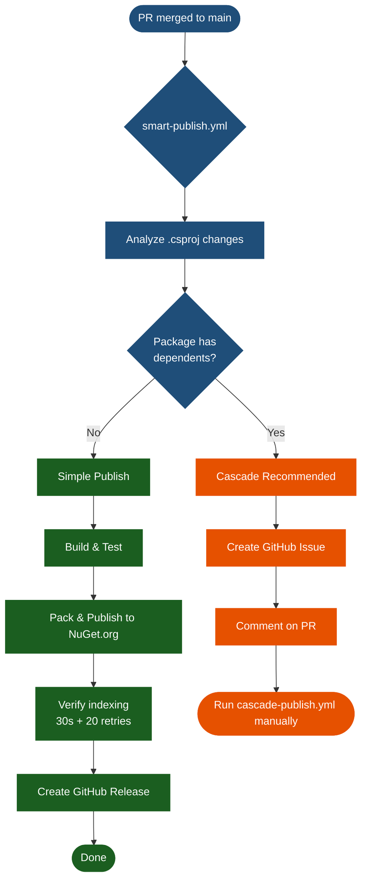

# Smart Publish Guide

How the automatic publishing flow works when a PR is merged to `main`.

---

## Overview

`smart-publish.yml` triggers automatically when a PR modifying `src/**/*.csproj` or `Directory.Packages.props` is merged to `main`. It analyzes package dependencies and chooses the right strategy.

> **Important**: This workflow detects version changes that were **already made** in your PR. You must update versions locally before opening the PR — the workflow does not modify versions itself.

---

## How to Prepare a PR for Smart Publish

**Step 1 — Update version locally**

```powershell
# Recommended: use the script
.\upgrade-version.ps1 -PackageName Barcode -BumpType patch

# Or manually edit:
# 1. src/Acontplus.Barcode/Acontplus.Barcode.csproj  →  <Version>1.1.2</Version>
# 2. Directory.Packages.props  →  <PackageVersion Include="Acontplus.Barcode" Version="1.1.2" />
```

**Step 2 — Commit, push, and open a PR**

```bash
git add .
git commit -m "feat(barcode): add new QR format"
git push origin feature/my-change
# Open PR on GitHub
```

**Step 3 — Merge the PR**

`smart-publish.yml` starts automatically. No further action needed for simple publishes.

---

## Decision Flow



---

## Strategy: Simple Publish

Used when the changed package has **no internal dependents**.

Packages that always publish simply (no one depends on them within the monorepo):

- `Acontplus.Barcode`
- `Acontplus.S3Application`
- `Acontplus.Logging`
- `Acontplus.ApiDocumentation`

What happens:

1. Detects the version change in the merged PR
2. Runs tests
3. Packs the `.nupkg`
4. Pushes to NuGet.org
5. Verifies indexing (30-second wait + up to 20 retries)
6. Creates a GitHub Release

---

## Strategy: Cascade Recommended

Used when the changed package **has dependents** within the monorepo.

Packages that trigger cascade recommendations:

- `Acontplus.Core` — 12+ dependents
- `Acontplus.Utilities` — 4+ dependents
- `Acontplus.Persistence.Common` — 2 dependents

What happens:

1. Detects dependents in the dependency graph
2. Publishes the root package itself
3. Creates a **GitHub Issue** listing dependent packages and exact instructions
4. Comments on your merged PR
5. Waits for you to run `cascade-publish.yml` manually

---

## Workflow Comparison

| Feature                        | `smart-publish` | `cascade-publish` |  `build-test`  |
| ------------------------------ | :-------------: | :---------------: | :------------: |
| Trigger                        | Auto (PR merge) |      Manual       | Auto (push/PR) |
| Analyzes dependencies          |       ✅        |        ✅         |       ❌       |
| Auto-decides strategy          |       ✅        |        ❌         |       ❌       |
| Publishes simple packages      |       ✅        |        ✅         |       ❌       |
| Runs full cascade              |  ⚠️ recommends  |    ✅ executes    |       ❌       |
| Requires version pre-set in PR |       ✅        |        ❌         |      N/A       |
| Runs tests                     |       ✅        |        ✅         |       ✅       |

---

## Configuration

No setup required beyond:

| Secret         | Value                                                                        |
| -------------- | ---------------------------------------------------------------------------- |
| `NUGET_USER`   | Your NuGet.org username (account that created the Trusted Publishing policy) |
| `GITHUB_TOKEN` | Automatic — no configuration needed                                          |

`NUGET_API_KEY` is not used. Authentication is handled via NuGet Trusted Publishing (OIDC).

---

## Troubleshooting

| Problem                         | Cause                                | Solution                                                |
| ------------------------------- | ------------------------------------ | ------------------------------------------------------- |
| Workflow did not run            | PR didn't modify `.csproj` files     | Ensure version is bumped in `.csproj`                   |
| "Already published" error       | Version already exists on NuGet.org  | Bump version again with `upgrade-version.ps1`           |
| Indexing timeout (20 retries)   | NuGet.org slow                       | Check NuGet.org manually; re-run if needed              |
| Issue not created               | GitHub Actions write permissions off | Settings → Actions → Permissions → Read and write       |
| Published when cascade expected | Dependency not detected              | Run `cascade-publish.yml` manually to update dependents |

---

## Related

- [[Cascade-Publish-Guide]] — Full guide for cascade workflows
- [[Persistence-Resilience-Guide]] — Retry and circuit breaker configuration
