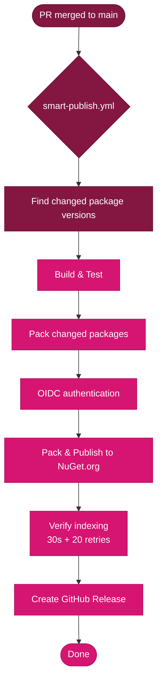

# Smart Publish Guide

How the automatic publishing flow works when a versioned PR is merged to `main`.

---

## Overview

`smart-publish.yml` triggers automatically when a PR modifying a package project (`src/**/*.csproj`) is merged to `main`. It publishes only package projects whose `<Version>` changed in that PR. Updating only `Directory.Packages.props`, or changing a project without changing its version, does not publish a package.

> **Important**: the workflow never changes package versions or dependency references. Prepare, review, and validate all release changes in the PR before merging it.

---

## How to Prepare a PR for Smart Publish

**Step 1 — Update the release set locally**

```powershell
# Recommended: use the script
.\upgrade-version.ps1 -PackageName Barcode -BumpType patch

# Or manually edit:
# 1. Update <Version> in every released package .csproj.
# 2. Update its central PackageVersion in Directory.Packages.props.
# 3. If a package consumes an updated Acontplus.* dependency,
#    update the consuming PackageReference through Directory.Packages.props
#    and bump that consumer's package version in the same PR.
```

**Step 2 — Commit, push, and open a PR**

```bash
git add .
git commit -m "feat(barcode): add new QR format"
git push origin feature/my-change
# Open PR on GitHub
```

**Step 3 — Merge the reviewed PR**

`smart-publish.yml` starts automatically. It builds, tests, packs, publishes, verifies indexing, and creates one GitHub Release for the changed package versions.

---

## Decision Flow


```mermaid
flowchart TD
  A([PR merged to main]) --> B{smart-publish.yml}
  B --> C[Find changed package versions]
  C --> D[Build & Test]
  D --> E[Pack changed packages]
  E --> F[OIDC authentication]
  F --> G[Pack & Publish to NuGet.org]
  G --> H[Verify indexing<br/>30s + 20 retries]
  H --> I[Create GitHub Release]
  I --> J([Done])

  classDef green fill:#d61572,color:#fff,stroke:#b01260
  classDef orange fill:#0a7db5,color:#fff,stroke:#085e8a
  classDef blue fill:#831742,color:#fff,stroke:#6a1235

  class D,E,F,G,H,I,J green
  class A,B,C blue
```

---

## Release Set and Dependency Order

When a package update changes the version that another Acontplus package consumes, release the dependency and each affected consumer together in one PR. Update them in dependency order: dependencies first, then dependents.

The workflow can publish multiple changed packages in parallel, but the committed dependency references must already resolve to the new versions. CI validates the full solution before merge; the publisher does not calculate, modify, or repair a release set after merge.

See [[Architecture]] for the package dependency graph.

## What Happens After Merge

1. Detects the versioned package projects changed by the merged PR.
2. Restores and builds the solution.
3. Runs the matching `*.Tests.Unit.csproj` project when it exists and uploads Cobertura coverage as a workflow artifact.
4. Packs and publishes each changed package to NuGet.org.
5. Verifies NuGet indexing with retries.
6. Creates a GitHub Release containing the generated packages.

---

## Configuration

Configure NuGet Trusted Publishing for `smart-publish.yml`, and set the following repository secret:

| Secret         | Value                                                                        |
| -------------- | ---------------------------------------------------------------------------- |
| `NUGET_USER`   | Your NuGet.org username (account that created the Trusted Publishing policy) |
| `GITHUB_TOKEN` | Automatic — no configuration needed                                          |

The publish job requests `id-token: write` and exchanges it with NuGet.org using `NuGet/login@v1`. `NUGET_API_KEY` is not used.

---

## Troubleshooting

| Problem                         | Cause                                | Solution                                                |
| ------------------------------- | ------------------------------------ | ------------------------------------------------------- |
| Workflow did not run | PR did not change a package `.csproj` | Include the intended package version changes in the PR. |
| Restore or build fails | A dependency reference and release set are inconsistent | Update every affected `Acontplus.*` central reference and package version in the same PR. |
| "Already published" | The package version already exists on NuGet.org | Use a new SemVer version, update the PR, and merge it. |
| Indexing timeout | NuGet.org is slow to index | Check NuGet.org; the workflow logs the warning after retries. |
| OIDC login fails | Trusted Publishing policy does not match the workflow/environment | Verify the policy is for `smart-publish.yml` and the `production` environment. |

---

## Related

- [NuGet Trusted Publishing](https://learn.microsoft.com/en-us/nuget/nuget-org/trusted-publishing)
- [[Persistence-Resilience-Guide]] — Retry and circuit breaker configuration
